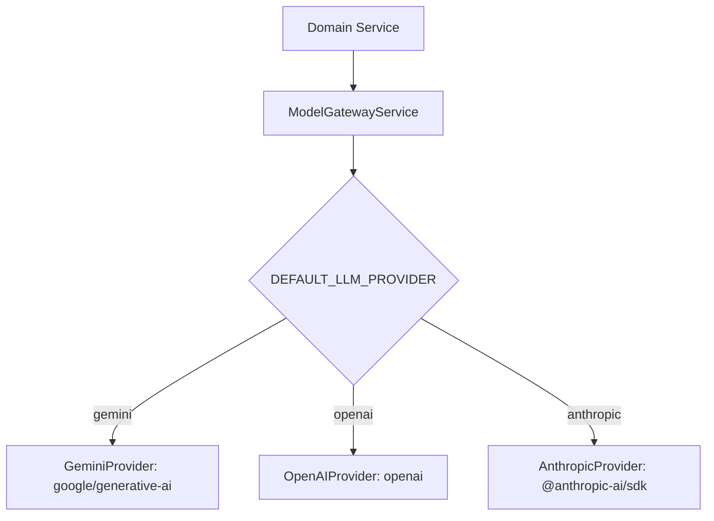

# AI & Bot Orchestration Design Document

This document outlines the AI orchestration layer, multi-provider abstraction wrappers, RAG ingestion pipelines, citation generation, and prompt history logging.

---

## 1. Model Provider Abstraction Layer (ModelGateway)
To avoid lock-in to any single paid LLM provider, we implement a decoupled `ModelGatewayService` that translates generic prompt configurations into provider-specific API calls:



### Abstraction Interface
```typescript
interface ILLMRequest {
  systemPrompt: string;
  userMessage: string;
  chatHistory: Array<{ role: 'user' | 'model', content: string }>;
  temperature?: number;
  maxTokens?: number;
  responseFormat?: 'text' | 'json';
}

interface ILLMResponse {
  text: string;
  usage: {
    inputTokens: number;
    outputTokens: number;
    totalCostUSD: number;
  };
  latencyMs: number;
  providerModelUsed: string;
}
```

---

## 2. RAG Ingestion & Document Pipeline
The knowledge base ingestion service processes external sources (PDFs, URL crawls, Confluence logs) to sync search scopes:

```text
Upload Source -> Extract Text -> Clean/Sanitize -> Chunk Text -> Embed Chunks -> Upsert Vector DB
```

### 1. Document Extraction & Cleaning
- PDFs are parsed using node-based library streams.
- URLs are crawled up to configured crawl depth. HTML is stripped of script tags and converted to markdown.

### 2. Chunking & Token Splits
- **Strategy**: Recursive Character Text Chunking.
- **Config Defaults**:
  - `chunkSize`: 500 characters (optimized for concise support lookup).
  - `chunkOverlap`: 50 characters (ensures query context is preserved across splits).
- **Target Fields**: Extract headers, source metadata (page numbers, sheet IDs), and the raw text block.

### 3. Vector Embeddings
- **Provider**: Google Vertex AI / Gemini Embeddings (`text-embedding-004`) or OpenAI `text-embedding-3-small`.
- **Target Store**: MongoDB Atlas Vector Search (supported on the free tier, avoiding paid external vector DB nodes).

---

## 3. RAG Retrieval & Citation Architecture
When a customer queries the public bot widget:
1. Generate the query's vector embedding.
2. Query the MongoDB Atlas Vector Search index using a cosine similarity threshold of `0.70`.
3. Fetch the top 3 matching document chunks.
4. Build the LLM prompt payload, appending the retrieved context chunks.
5. In the response, require the LLM to output footnotes (e.g., `[1]`, `[2]`) pointing to the citation metadata.
6. Return both the generated text response and the citation references array to the customer UI:
   ```json
   {
     "answer": "Yes, we accept returns within 30 days [1].",
     "citations": [
       { "id": "[1]", "sourceName": "Return Policy PDF", "url": "/docs/returns.pdf" }
     ]
   }
   ```

---

## 4. Operational Auditing & Telemetry
Every AI transaction is logged in the `ai_interaction_logs` collection to track usage benchmarks:

```typescript
interface IAiInteractionLog {
  _id: ObjectId;
  tenantId: string;
  userId?: string;         // Customer or Agent ID
  conversationId?: string;
  provider: string;
  modelName: string;
  promptTokens: number;
  completionTokens: number;
  latencyMs: number;
  estimatedCostUSD: number;
  timestamp: Date;
  status: 'success' | 'safety_blocked' | 'error';
}
```

### Safety Intercept Filters
Before dispatching queries to Gemini or OpenAI, compile requests through safety scoring. If the response contains flags exceeding toxicity thresholds, truncate output, log the jailbreak attempt event in `audit_logs`, and return the welcome fallback error template.