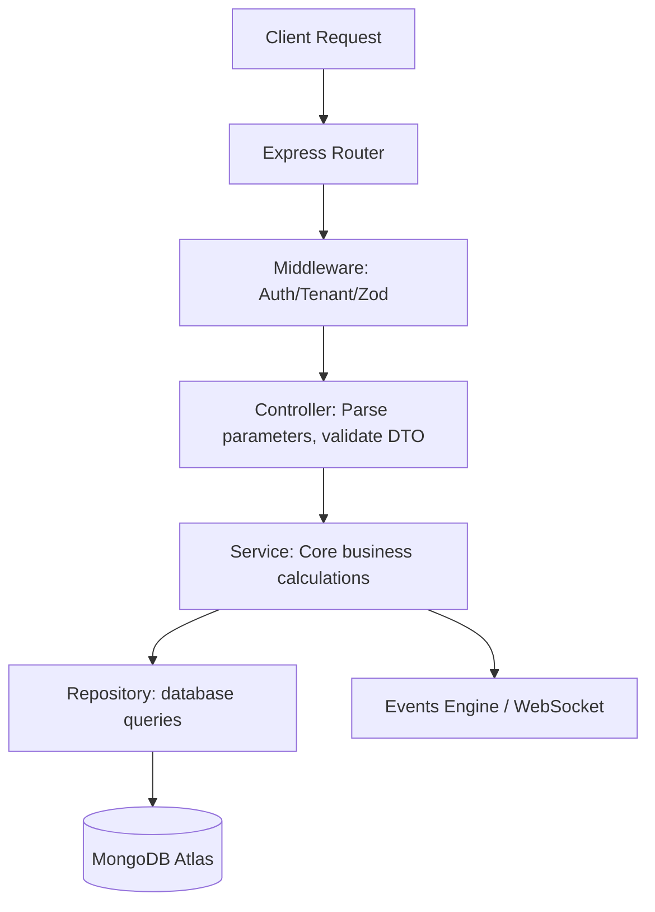
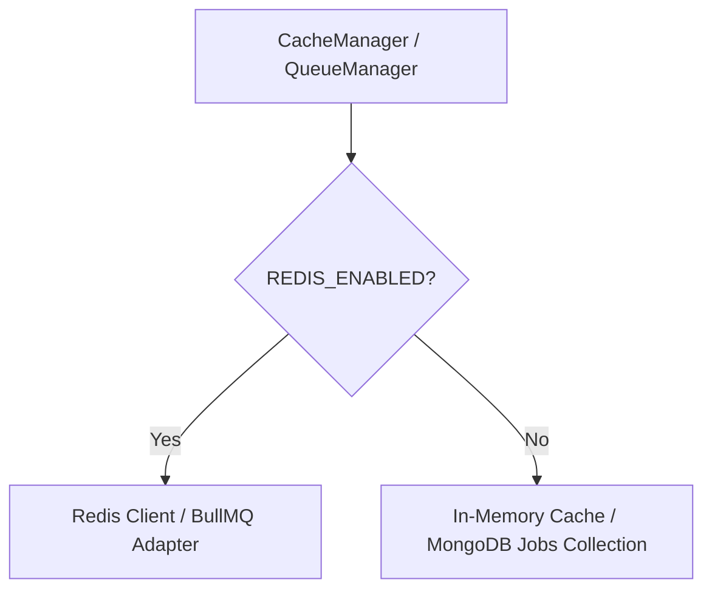

# System Architecture Document

This document outlines the architectural standards, domain boundaries, service layers, error-handling conventions, and structural organization of the `CustomerSelfService` backend.

---

## 1. Architectural Strategy: Modular Monolith
To optimize local debugging, keep deployment costs to a minimum, and accommodate AI-assisted development, we implement a **Modular Monolith** first, designed to be **Microservice-Ready** for future extraction.

```text
                                 +--------------------------------+
                                 |         Express Server         |
                                 +--------------------------------+
                                                 |
                       +-------------------------+-------------------------+
                       |                         |                         |
               +---------------+         +---------------+         +---------------+
               |  Auth Module  |         |  Bots Module  |         | Tickets Module|
               | (src/modules) |         | (src/modules) |         | (src/modules) |
               +---------------+         +---------------+         +---------------+
                       |                         |                         |
                       +-------------------------+-------------------------+
                                                 |
                                     +-----------------------+
                                     |  Common Library/Utils |
                                     +-----------------------+
                                                 |
                                     +-----------------------+
                                     |   Database / Cache    |
                                     +-----------------------+
```

### Key Constraints
1. **Module Segregation**: Each feature in `src/modules/*` acts as an independent business domain. It owns its models, routing, schemas, and services.
2. **No Model Sharing**: No service in `src/modules/A` may import a Mongoose model from `src/modules/B`. Cross-module communication must happen exclusively by importing and invoking the public service class of Module B.
3. **No Direct Database access from Controllers**: Controllers must execute database logic only via Service and Repository delegations.

---

## 2. Directory Structure Blueprint
```text
backend/src/
├── common/             # Shared filters, middleware, logging, and error wrappers
│   ├── errors/         # Base application error classes (HttpException, etc.)
│   ├── middleware/     # Tenant contextual injectors, auth guards, request loggers
│   └── utils/          # Text formatters, crypto helpers, calculation engines
├── config/             # System settings, config validation (Zod schema checking)
├── database/           # Mongoose connectors, global plugins, seeds and migration logs
├── modules/            # Isolated domain business units
│   ├── auth/           # Authentications, MFA steps, OTP codes, session tokens
│   ├── bots/           # Bot configurations, intent tables, NLU rollouts
│   ├── tickets/        # SLA, ticket workflows, category routing, queues
│   ├── chat/           # Conversation streams, messaging queues, attachments
│   └── qa/             # Scoring criteria, disputes, coaching matrices
└── index.ts            # Server entrypoint and Socket.io bootstrap
```

---

## 3. Modular Layer Boundaries (CSR)

The execution stack is strictly unidirectional:
`HTTP Request / Event` $\rightarrow$ `Router` $\rightarrow$ `Middleware (Context/Auth)` $\rightarrow$ `Controller` $\rightarrow$ `Service` $\rightarrow$ `Repository` $\rightarrow$ `Database (MongoDB)`



### Layer Definitions
- **Middleware**: Extracts JWT or custom headers to verify tenant bounds. Validates incoming DTO payloads using Zod before they enter the controllers.
- **Controllers**: Act as HTTP transport handlers. They map request inputs (headers, body, params, query) into services and return standard JSON envelope payloads.
- **Services**: Orchestrate the core business logic. They run computations, invoke third-party services (e.g. Gemini AI, Twilio), and emit internal domain events.
- **Repositories**: Encapsulate Mongoose queries. They export clear, business-named methods (e.g. `findByStatus(tenantId, status)`).

---

## 4. Cache & Queue Abstraction (Redis-Optional Strategy)
To support free hosting tiers, Redis is an optional configuration. The system abstracts cache and event interfaces.



### Abstraction Interfaces
- **CacheService**: Provides `get<T>(key)`, `set(key, val, ttl)`, and `del(key)` methods.
- **EventBroker**: Local events emit via Node's `EventEmitter` in-memory. If Redis is active, events publish/subscribe over Redis channels.
- **JobQueue**: Falls back to polling a MongoDB `background_jobs` collection when Redis is inactive.

---

## 5. Global Error Handling Hierarchy
All errors inherit from a base `AppError` class which extends the native `Error` class:

```text
          +--------------------------------------+
          |               AppError               |
          +--------------------------------------+
                             |
             +---------------+---------------+
             |                               |
  +--------------------+           +--------------------+
  |   HttpException    |           |   DomainException  |
  +--------------------+           +--------------------+
```

- **HttpException**: Includes an HTTP status code (e.g., 400, 401, 403, 404, 429).
- **DomainException**: Internal domain errors (e.g., `SlaBreachedError`, `BotNotTrainedError`) that are mapped to specific HTTP codes at the global error controller boundary.

### Error Response Envelope
```json
{
  "success": false,
  "error": {
    "code": "BAD_REQUEST",
    "message": "Validation failed.",
    "details": [
      {
        "field": "email",
        "message": "Invalid email address format."
      }
    ]
  }
}
```

---

## 6. Unified Logging & Telemetry Patterns
The system uses `winston` (or a similar lightweight free logging library) configured with three goals:
1. **Tenant Isolation**: Log entries contain `tenantId` whenever context is available.
2. **Severity Levels**:
   - `error`: Database crashes, system configuration failures, critical API timeouts.
   - `warn`: Model latency breaches, invalid validation attempts, rate limit warnings.
   - `info`: Successful agent logins, ticket state changes, background job rollouts.
   - `debug`: Raw payload traces (only enabled in development).
3. **PII Masking**: Custom transport serializers intercept parameters like passwords, email fields, and token signatures, replacing them with a `[REDACTED]` mask.