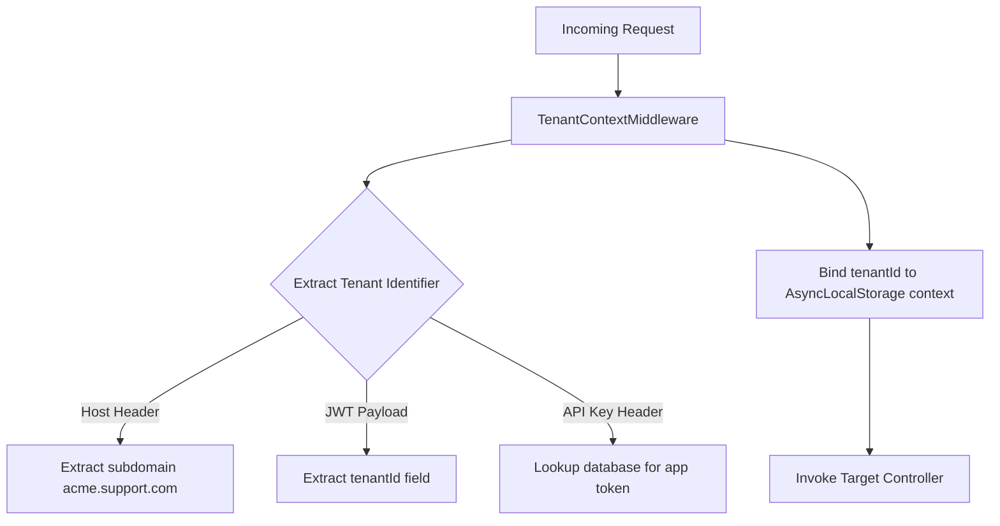

# Authentication & RBAC Design Document

This document outlines the authentication flows, role-based authorization, JWT cookie security parameters, MFA readiness, and tenant context isolation guardrails.

---

## 1. Authentication Strategy: JWT Cookie & Bearer Rotation
We implement double-token authentication to manage session persistence:
1. **Access Token**: A short-lived (15-minute) JSON Web Token (JWT) containing basic user metadata and active permissions. Passed via an HTTP-Only secure cookie for web sessions, or via the `Authorization: Bearer <token>` header for mobile SDK/telephony callers.
2. **Refresh Token**: A long-lived (7-day) cryptographically random UUID string stored in the database. Refreshed using the `/api/v1/auth/refresh` route.

```text
+--------+            HTTP POST /signin             +--------+
| Client | ---------------------------------------> | Server |
|        | <--------------------------------------- |        | (Sets HTTP-Only Access + Refresh Cookies)
+--------+        Access (15m) + Refresh (7d)       +--------+
    |
    | (Access token expires)
    v
+--------+            HTTP POST /refresh            +--------+
| Client | ---------------------------------------> | Server |
|        | <--------------------------------------- |        | (Rotates Refresh Token and issues new Access)
+--------+             New Access Token             +--------+
```

### Cookie Security Flags
- `httpOnly: true` (Prevents client-side scripts from reading the session tokens)
- `secure: true` (Requires HTTPS connection context)
- `sameSite: 'strict'` (Mitigates CSRF attack surfaces)

---

## 2. Refresh Token Rotation (RTR)
To prevent compromised refresh tokens from maintaining persistent sessions:
1. When a user requests a session extension via `/refresh`, the server compares the provided refresh token with the hash in the database.
2. **On Match**: Re-sign a new access token, generate a **new** refresh token, replace the old one in the DB, and return both to the client.
3. **On Re-use Detection**: If a client attempts to refresh using a token that was *already* rotated, the server flags a potential breach, invalidates the *entire* user session history, and forces a logout across all active devices.

---

## 3. Multi-Tenant Request Lifecycle
Every incoming HTTP request undergoes contextual scoping verification via Express middleware:



- **AsyncLocalStorage**: Isolates variables within execution fibers. Services can retrieve the active `tenantId` without requiring controllers to pass it explicitly through method calls.

---

## 4. Role & Permissions Matrix
The permissions matrix maps to the frontend `permissions.ts` rules, split across standard user roles:

| Permission Node | Super Admin | Client Admin | Operations Manager | QA Manager | Support Agent | Supervisor | Customer | Viewer |
| :--- | :---: | :---: | :---: | :---: | :---: | :---: | :---: | :---: |
| `sa_system_ops` | ✅ | ❌ | ❌ | ❌ | ❌ | ❌ | ❌ | ❌ |
| `bots_write` | ❌ | ✅ | ❌ | ❌ | ❌ | ❌ | ❌ | ❌ |
| `inbox_write` | ❌ | ✅ | ✅ | ❌ | ✅ | ❌ | ❌ | ❌ |
| `qa_evaluations` | ❌ | ✅ | ❌ | ✅ | ❌ | ❌ | ❌ | ❌ |
| `supervisor_wire`| ❌ | ✅ | ✅ | ❌ | ❌ | ✅ | ❌ | ❌ |
| `customer_portal`| ❌ | ❌ | ❌ | ❌ | ❌ | ❌ | ✅ | ❌ |
| `view_only` | ❌ | ❌ | ❌ | ❌ | ❌ | ❌ | ❌ | ✅ |

### Route Protection Middleware (Express)
```typescript
import { Request, Response, NextFunction } from 'express';

export function hasPermission(requiredPermission: string) {
  return (req: Request, res: Response, next: NextFunction) => {
    const userPermissions = req.user?.permissions || [];
    if (req.user?.role === 'super_admin' || userPermissions.includes(requiredPermission)) {
      return next();
    }
    return res.status(403).json({
      success: false,
      error: { code: 'FORBIDDEN', message: 'Insufficient scope permissions.' }
    });
  };
}
```

---

## 5. WebSocket Connection Authentication
Socket.io handshakes undergo token validation:
1. When establishing a WebSocket connection (`io.connect`), the client passes the JWT access token in the `auth` credentials packet.
2. The server middleware parses and validates the token signature:
   ```typescript
   io.use((socket, next) => {
     const token = socket.handshake.auth.token || parseCookies(socket.handshake.headers.cookie).token;
     try {
       const payload = jwt.verify(token, JWT_SECRET);
       socket.user = payload;
       next();
     } catch (err) {
       next(new Error("Unauthorized WebSocket handshake"));
     }
   });
   ```
3. Upon validation, the socket joins the tenant-specific room: `socket.join(`tenant:${socket.user.tenantId}`)`.

---

## 6. Multi-Factor Authentication (MFA) & Step-up OTP Flow
Sensitive actions (like billing changes, bot deployment promotions, and customer refund claims) require **Step-up OTP Authentication**:

```text
Action Triggered -> Check MFA Token -> Valid? -> Proceed
                                   -> Missing -> Prompt OTP -> Verify OTP -> Proceed
```

1. **OTP Setup**: Uses TOTP (Time-based One-Time Passwords). The server generates a secret, exposes a QR code (using `otpauth` or generic self-hosted crypto), and saves the hash in `users.mfaSecret`.
2. **OTP Challenge**: The server returns HTTP status `403` with code `OTP_REQUIRED` and a temporary challenge transaction token.
3. **OTP Verification**: The user submits the OTP code to `/api/v1/auth/mfa/verify`. If verified, the server signs a single-use step-up token valid for 5 minutes to complete the transaction.