# Client Admin Domain Reconciliation & Operational Audit

## 1. Executive Summary

This audit establishes a complete reconciliation and classification pass of the Client Admin domain in the Customer Self Service codebase. By cross-checking the implemented React components, Zustand stores, and Next.js shell routing against the original 161-screen inventory, we evaluate the system's operational maturity, persona boundaries, and information architecture.

Key findings show that the codebase represents a highly advanced, consolidated implementation where logical spreadsheet lines (such as modal dialogues, details drawers, or confirmation states) have been intentionally merged into unified, context-rich pages. This approach prevents route explosions, minimizes navigation depth, and favors enterprise workflow continuity over fragmented sub-routes.

---

## 2. Information Architecture (IA) & Sidebar Audit

### Current Navigation Structure
The current sidebar configuration for non-Super Admin roles (`client_admin`, `supervisor`, `qa_manager`, `operations_manager`, `viewer`) lists screens in a flat, unsorted sequence:
`supervisor_monitor` ➔ `qa_queue` ➔ `coaching` ➔ `training` ➔ `agents` ➔ `workforce` ➔ `inbox` ➔ `tickets` ➔ `agent_dashboard` ➔ `sla` ➔ `analytics_center` ➔ `knowledge_base` ➔ `bots` ➔ `surveys` ➔ `integrations` ➔ `billing` ➔ `rbac`.

This flat layout creates visual fatigue and lacks logical operational categories. 

### Proposed Normalized IA Grouping
To align with the finalized Super Admin architecture, the Client Admin sidebar should be grouped into distinct functional domains. The recommended structure organizes the active screens as follows:

```mermaid
graph TD
    CA[Client Admin Sidebar] --> OP[Operations & Workforce]
    CA --> AI[AI & Knowledge]
    CA --> CH[Channels & Integrations]
    CA --> GOV[Governance & Analytics]

    OP --> OP1["Supervisor Monitor (supervisor_monitor)"]
    OP --> OP2["Workforce Planning (workforce)"]
    OP --> OP3["Operations Monitoring (agents)"]
    
    AI --> AI1["Bot Administration (bots)"]
    AI --> AI2["Dialog Designer (dialog_flow)"]
    AI --> AI3["Intents / NLU (intents)"]
    AI --> AI4["Knowledge Base (knowledge_base)"]
    AI --> AI5["Safety & Guardrails (guardrails)"]
    AI --> AI6["Training Loop (training)"]

    CH --> CH1["Omnichannel (channels)"]
    CH --> CH2["Integrations (integrations)"]

    GOV --> GOV1["Analytics Center (analytics_center)"]
    GOV --> GOV2["SLA Dashboard (sla)"]
    GOV --> GOV3["Reports & Surveys (surveys)"]
    GOV --> GOV4["Billing (billing)"]
    GOV --> GOV5["RBAC Settings (rbac)"]
    GOV --> GOV6["Deployments (deployments)"]
```

#### Grouping Rationales:
1. **Operations & Workforce:** Consolidates real-time presence, agent scheduling, performance scorecards, and live monitoring interfaces.
2. **AI & Knowledge:** Houses bot configuration, intents training, vector chunking properties, safety guidelines, and visual canvas building.
3. **Channels & Integrations:** Connects third-party providers (WhatsApp, SMS, CRM) and handles IVR speech designers.
4. **Governance & Analytics:** Monitors business service level agreements, survey metrics, environments pipelines, and system configurations.

---

## 3. Inventory Reconciliation Matrix

Below is the reconciliation matrix mapping all 161 screens from the inventory list to their exact codebase files, statuses, and correct placement boundaries:

| ID | Category | Screen / Workflow Name | Status | Codebase Component / Location | Correct Placement |
| :--- | :--- | :--- | :--- | :--- | :--- |
| **1-15** | **Super Admin** | Platform Master Data & Infra | **Wrong Placement** | `src/components/super-admin/` | Super Admin Area Only |
| **16** | Bots | Bot list | **Fully Complete** | [BotsTab.tsx](file:///Users/sudhir88/Desktop/CustomerSelfService/frontend/src/components/client-admin/bots/BotsTab.tsx) | Client Admin / Bots |
| **17** | Bots | Bot create — basics | **Fully Complete** | [BotWizard.tsx](file:///Users/sudhir88/Desktop/CustomerSelfService/frontend/src/components/client-admin/bots/BotWizard.tsx#L324-L403) | Client Admin / Bots / Wizard |
| **18** | Bots | Bot create — persona | **Fully Complete** | [BotWizard.tsx](file:///Users/sudhir88/Desktop/CustomerSelfService/frontend/src/components/client-admin/bots/BotWizard.tsx#L405-L462) | Client Admin / Bots / Wizard |
| **19** | Bots | Bot create — channels | **Fully Complete** | [BotWizard.tsx](file:///Users/sudhir88/Desktop/CustomerSelfService/frontend/src/components/client-admin/bots/BotWizard.tsx#L464-L564) | Client Admin / Bots / Wizard |
| **20** | Bots | Bot create — knowledge | **Fully Complete** | [BotWizard.tsx](file:///Users/sudhir88/Desktop/CustomerSelfService/frontend/src/components/client-admin/bots/BotWizard.tsx#L566-L650) | Client Admin / Bots / Wizard |
| **21** | Bots | Bot create — test | **Fully Complete** | [BotWizard.tsx](file:///Users/sudhir88/Desktop/CustomerSelfService/frontend/src/components/client-admin/bots/BotWizard.tsx#L652-L760) | Client Admin / Bots / Wizard |
| **22** | Bots | Bot create — publish | **Fully Complete** | [BotWizard.tsx](file:///Users/sudhir88/Desktop/CustomerSelfService/frontend/src/components/client-admin/bots/BotWizard.tsx#L761-L840) | Client Admin / Bots / Wizard |
| **23** | Bots | Bot detail / overview | **Correctly Merged** | [BotCard.tsx](file:///Users/sudhir88/Desktop/CustomerSelfService/frontend/src/components/client-admin/bots/BotCard.tsx) | Client Admin / Bots / Grid Card |
| **24** | Bots | Persona editor | **Correctly Merged** | [BotEditPersonaModal.tsx](file:///Users/sudhir88/Desktop/CustomerSelfService/frontend/src/components/client-admin/bots/BotEditPersonaModal.tsx) | Client Admin / Bots / Modal |
| **25** | Bots | Welcome / fallback copy | **Correctly Merged** | [BotEditPersonaModal.tsx](file:///Users/sudhir88/Desktop/CustomerSelfService/frontend/src/components/client-admin/bots/BotEditPersonaModal.tsx) | Client Admin / Bots / Modal |
| **26** | NLU | Intents list | **Fully Complete** | [IntentsList.tsx](file:///Users/sudhir88/Desktop/CustomerSelfService/frontend/src/components/client-admin/nlu/IntentsList.tsx) | Client Admin / NLU |
| **27** | NLU | Intent detail | **Correctly Merged** | [IntentsTable.tsx](file:///Users/sudhir88/Desktop/CustomerSelfService/frontend/src/components/client-admin/nlu/IntentsTable.tsx) | Client Admin / NLU / Edit Drawer |
| **28** | NLU | Entity types | **Fully Complete** | [EntityTypesPanel.tsx](file:///Users/sudhir88/Desktop/CustomerSelfService/frontend/src/components/client-admin/nlu/EntityTypesPanel.tsx) | Client Admin / NLU / Entities |
| **29** | NLU | Slot filling editor | **Fully Complete** | [SlotValidationSandbox.tsx](file:///Users/sudhir88/Desktop/CustomerSelfService/frontend/src/components/client-admin/nlu/SlotValidationSandbox.tsx) | Client Admin / NLU / Sandbox |
| **30** | Flows | Dialog flow builder | **Fully Complete** | [DialogFlowLayout.tsx](file:///Users/sudhir88/Desktop/CustomerSelfService/frontend/src/components/client-admin/dialog-builder/DialogFlowLayout.tsx) | Client Admin / Dialog Flows |
| **31** | Flows | Decision tree node | **Fully Complete** | [ConditionNode.tsx](file:///Users/sudhir88/Desktop/CustomerSelfService/frontend/src/components/client-admin/dialog-builder/nodes/ConditionNode.tsx) | Client Admin / Dialog Flows |
| **32** | Flows | API call node | **Fully Complete** | [APIActionNode.tsx](file:///Users/sudhir88/Desktop/CustomerSelfService/frontend/src/components/client-admin/dialog-builder/nodes/APIActionNode.tsx) | Client Admin / Dialog Flows |
| **33** | Flows | DB query node | **Fully Complete** | [APIActionNode.tsx](file:///Users/sudhir88/Desktop/CustomerSelfService/frontend/src/components/client-admin/dialog-builder/nodes/APIActionNode.tsx) | Client Admin / Dialog Flows |
| **34** | Flows | RAG retrieval node | **Fully Complete** | [KnowledgeSearchNode.tsx](file:///Users/sudhir88/Desktop/CustomerSelfService/frontend/src/components/client-admin/dialog-builder/nodes/KnowledgeSearchNode.tsx) | Client Admin / Dialog Flows |
| **35** | Flows | Agent (tool-use) node | **Fully Complete** | [VariableSetNode.tsx](file:///Users/sudhir88/Desktop/CustomerSelfService/frontend/src/components/client-admin/dialog-builder/nodes/VariableSetNode.tsx) | Client Admin / Dialog Flows |
| **36** | Flows | Form node | **Fully Complete** | [MessageNode.tsx](file:///Users/sudhir88/Desktop/CustomerSelfService/frontend/src/components/client-admin/dialog-builder/nodes/MessageNode.tsx) | Client Admin / Dialog Flows |
| **37** | Flows | Card / carousel node | **Fully Complete** | [MessageNode.tsx](file:///Users/sudhir88/Desktop/CustomerSelfService/frontend/src/components/client-admin/dialog-builder/nodes/MessageNode.tsx) | Client Admin / Dialog Flows |
| **38** | Flows | Branch / condition node | **Fully Complete** | [ConditionNode.tsx](file:///Users/sudhir88/Desktop/CustomerSelfService/frontend/src/components/client-admin/dialog-builder/nodes/ConditionNode.tsx) | Client Admin / Dialog Flows |
| **39** | Flows | Human handoff node | **Fully Complete** | [HumanHandoffNode.tsx](file:///Users/sudhir88/Desktop/CustomerSelfService/frontend/src/components/client-admin/dialog-builder/nodes/HumanHandoffNode.tsx) | Client Admin / Dialog Flows |
| **40** | Flows | Variables inspector | **Fully Complete** | [VariablesSidebar.tsx](file:///Users/sudhir88/Desktop/CustomerSelfService/frontend/src/components/client-admin/dialog-builder/inspectors/VariablesSidebar.tsx) | Client Admin / Dialog Flows |
| **41** | Flows | Flow simulator | **Fully Complete** | [SimulationPanel.tsx](file:///Users/sudhir88/Desktop/CustomerSelfService/frontend/src/components/client-admin/dialog-builder/simulation/SimulationPanel.tsx) | Client Admin / Dialog Flows |
| **42** | Flows | Regression suite | **Correctly Merged** | [SimulationPanel.tsx](file:///Users/sudhir88/Desktop/CustomerSelfService/frontend/src/components/client-admin/dialog-builder/simulation/SimulationPanel.tsx) | Client Admin / Dialog Flows |
| **43** | Knowledge | Sources list | **Fully Complete** | [KnowledgeBaseTab.tsx](file:///Users/sudhir88/Desktop/CustomerSelfService/frontend/src/components/client-admin/knowledge/KnowledgeBaseTab.tsx) | Client Admin / Knowledge Base |
| **44** | Knowledge | Source — file upload | **Fully Complete** | [FileUploadModal.tsx](file:///Users/sudhir88/Desktop/CustomerSelfService/frontend/src/components/client-admin/knowledge/FileUploadModal.tsx) | Client Admin / Knowledge Base |
| **45** | Knowledge | Source — URL crawl | **Fully Complete** | [UrlCrawlModal.tsx](file:///Users/sudhir88/Desktop/CustomerSelfService/frontend/src/components/client-admin/knowledge/UrlCrawlModal.tsx) | Client Admin / Knowledge Base |
| **46** | Knowledge | Source — connector | **Fully Complete** | [DatabaseConnectorModal.tsx](file:///Users/sudhir88/Desktop/CustomerSelfService/frontend/src/components/client-admin/knowledge/DatabaseConnectorModal.tsx) | Client Admin / Knowledge Base |
| **47** | Knowledge | Source — DB / SQL | **Fully Complete** | [DatabaseConnectorModal.tsx](file:///Users/sudhir88/Desktop/CustomerSelfService/frontend/src/components/client-admin/knowledge/DatabaseConnectorModal.tsx) | Client Admin / Knowledge Base |
| **48** | Knowledge | Ingestion logs | **Correctly Merged** | [KnowledgeBaseTab.tsx](file:///Users/sudhir88/Desktop/CustomerSelfService/frontend/src/components/client-admin/knowledge/KnowledgeBaseTab.tsx) | Client Admin / Knowledge Base |
| **49** | Knowledge | Reindex | **Fully Complete** | [ReindexConfirmationModal.tsx](file:///Users/sudhir88/Desktop/CustomerSelfService/frontend/src/components/client-admin/knowledge/ReindexConfirmationModal.tsx) | Client Admin / Knowledge Base |
| **50** | Knowledge | Chunking config | **Correctly Merged** | [KnowledgeBaseTab.tsx](file:///Users/sudhir88/Desktop/CustomerSelfService/frontend/src/components/client-admin/knowledge/KnowledgeBaseTab.tsx) | Client Admin / Knowledge Base |
| **51** | Knowledge | Citation display config | **Correctly Merged** | [GuardrailsTab.tsx](file:///Users/sudhir88/Desktop/CustomerSelfService/frontend/src/components/client-admin/safety/GuardrailsTab.tsx) | Client Admin / Safety |
| **52** | Safety | Guardrails — topics | **Fully Complete** | [GuardrailsTab.tsx](file:///Users/sudhir88/Desktop/CustomerSelfService/frontend/src/components/client-admin/safety/GuardrailsTab.tsx) | Client Admin / Safety |
| **53** | Safety | Guardrails — PII | **Fully Complete** | [GuardrailsTab.tsx](file:///Users/sudhir88/Desktop/CustomerSelfService/frontend/src/components/client-admin/safety/GuardrailsTab.tsx) | Client Admin / Safety |
| **54** | Safety | Guardrails — jailbreak | **Fully Complete** | [GuardrailsTab.tsx](file:///Users/sudhir88/Desktop/CustomerSelfService/frontend/src/components/client-admin/safety/GuardrailsTab.tsx) | Client Admin / Safety |
| **55** | Safety | Guardrails — escalation | **Fully Complete** | [GuardrailsTab.tsx](file:///Users/sudhir88/Desktop/CustomerSelfService/frontend/src/components/client-admin/safety/GuardrailsTab.tsx) | Client Admin / Safety |
| **56** | Channels | Web widget config | **Fully Complete** | [ChannelsTab.tsx](file:///Users/sudhir88/Desktop/CustomerSelfService/frontend/src/components/client-admin/channels/ChannelsTab.tsx) | Client Admin / Channels |
| **57** | Channels | WhatsApp config | **Fully Complete** | [ChannelsTab.tsx](file:///Users/sudhir88/Desktop/CustomerSelfService/frontend/src/components/client-admin/channels/ChannelsTab.tsx) | Client Admin / Channels |
| **58** | Channels | SMS config | **Fully Complete** | [ChannelsTab.tsx](file:///Users/sudhir88/Desktop/CustomerSelfService/frontend/src/components/client-admin/channels/ChannelsTab.tsx) | Client Admin / Channels |
| **59** | Channels | Email helpdesk inbox | **Fully Complete** | [ChannelsTab.tsx](file:///Users/sudhir88/Desktop/CustomerSelfService/frontend/src/components/client-admin/channels/ChannelsTab.tsx) | Client Admin / Channels |
| **60** | Channels | Voice IVR designer | **Fully Complete** | [VoiceIvrDesigner.tsx](file:///Users/sudhir88/Desktop/CustomerSelfService/frontend/src/components/client-admin/channels/VoiceIvrDesigner.tsx) | Client Admin / Channels / Voice IVR |
| **61** | Channels | Mobile SDK keys | **Fully Complete** | [ChannelsTab.tsx](file:///Users/sudhir88/Desktop/CustomerSelfService/frontend/src/components/client-admin/channels/ChannelsTab.tsx) | Client Admin / Channels |
| **62** | Channels | Social (FB/IG/X) | **Fully Complete** | [ChannelsTab.tsx](file:///Users/sudhir88/Desktop/CustomerSelfService/frontend/src/components/client-admin/channels/ChannelsTab.tsx) | Client Admin / Channels |
| **63** | Channels | Slack / Teams | **Fully Complete** | [ChannelsTab.tsx](file:///Users/sudhir88/Desktop/CustomerSelfService/frontend/src/components/client-admin/channels/ChannelsTab.tsx) | Client Admin / Channels |
| **64** | Operations | Business hours | **Fully Complete** | [BusinessHours.tsx](file:///Users/sudhir88/Desktop/CustomerSelfService/frontend/src/components/client-admin/operations/BusinessHours.tsx) | Client Admin / Operations |
| **65** | Operations | Routing rules | **Fully Complete** | [RoutingRules.tsx](file:///Users/sudhir88/Desktop/CustomerSelfService/frontend/src/components/client-admin/operations/RoutingRules.tsx) | Client Admin / Operations |
| **66** | Operations | Queue management | **Fully Complete** | [QueueManagement.tsx](file:///Users/sudhir88/Desktop/CustomerSelfService/frontend/src/components/client-admin/operations/QueueManagement.tsx) | Client Admin / Operations |
| **67** | Operations | Agent roster | **Fully Complete** | [AgentRoster.tsx](file:///Users/sudhir88/Desktop/CustomerSelfService/frontend/src/components/client-admin/operations/AgentRoster.tsx) | Client Admin / Operations |
| **68** | Operations | Agent skills profile | **Fully Complete** | [SkillsMatrix.tsx](file:///Users/sudhir88/Desktop/CustomerSelfService/frontend/src/components/client-admin/operations/SkillsMatrix.tsx) | Client Admin / Operations |
| **69** | Operations | Agent live status board | **Fully Complete** | [LivePresenceBoard.tsx](file:///Users/sudhir88/Desktop/CustomerSelfService/frontend/src/components/client-admin/operations/LivePresenceBoard.tsx) | Client Admin / Operations |
| **70** | Agent | Unified inbox | **Wrong Placement** | [UnifiedInbox.tsx](file:///Users/sudhir88/Desktop/CustomerSelfService/frontend/src/components/agent-workspace/UnifiedInbox.tsx) | Agent Workspace |
| **71** | Agent | Conversation detail | **Wrong Placement** | [ConversationPanel.tsx](file:///Users/sudhir88/Desktop/CustomerSelfService/frontend/src/components/agent-workspace/ConversationPanel.tsx) | Agent Workspace |
| **72** | Agent | Customer 360 | **Wrong Placement** | [Customer360Drawer.tsx](file:///Users/sudhir88/Desktop/CustomerSelfService/frontend/src/components/agent-workspace/Customer360Drawer.tsx) | Agent Workspace |
| **73** | Agent | Macros / canned responses | **Wrong Placement** | [ConversationPanel.tsx](file:///Users/sudhir88/Desktop/CustomerSelfService/frontend/src/components/agent-workspace/ConversationPanel.tsx) | Agent Workspace |
| **74** | Agent | Co-browse / screen share | **Wrong Placement** | [TransferModal.tsx](file:///Users/sudhir88/Desktop/CustomerSelfService/frontend/src/components/agent-workspace/TransferModal.tsx) | Agent Workspace |
| **75** | Agent | Agent co-pilot reply | **Wrong Placement** | [AIReplyComposer.tsx](file:///Users/sudhir88/Desktop/CustomerSelfService/frontend/src/components/agent-workspace/AIReplyComposer.tsx) | Agent Workspace |
| **76** | Agent | Sentiment indicator | **Wrong Placement** | [SentimentBadge.tsx](file:///Users/sudhir88/Desktop/CustomerSelfService/frontend/src/components/agent-workspace/SentimentBadge.tsx) | Agent Workspace |
| **77** | Agent | Tag / label editor | **Wrong Placement** | [Customer360Drawer.tsx](file:///Users/sudhir88/Desktop/CustomerSelfService/frontend/src/components/agent-workspace/Customer360Drawer.tsx) | Agent Workspace |
| **78** | Agent | Disposition codes | **Wrong Placement** | [WrapupModal.tsx](file:///Users/sudhir88/Desktop/CustomerSelfService/frontend/src/components/agent-workspace/WrapupModal.tsx) | Agent Workspace |
| **79** | Tickets | Tickets list | **Wrong Placement** | `AgentWorkspaceView` (subscreen: tickets) | Agent Workspace |
| **80** | Tickets | Ticket detail | **Wrong Placement** | `AgentWorkspaceView` (subscreen: tickets) | Agent Workspace |
| **81** | Tickets | SLA policies | **Fully Complete** | [SlaTab.tsx](file:///Users/sudhir88/Desktop/CustomerSelfService/frontend/src/components/client-admin/operations/SlaTab.tsx) | Client Admin / Operations |
| **82** | Tickets | SLA breach dashboard | **Fully Complete** | [SlaAnalytics.tsx](file:///Users/sudhir88/Desktop/CustomerSelfService/frontend/src/components/analytics/SlaAnalytics.tsx) | Client Admin / Analytics |
| **83** | Tickets | Escalation matrix | **Fully Complete** | [StaffingEscalationWorkflow.tsx](file:///Users/sudhir88/Desktop/CustomerSelfService/frontend/src/components/client-admin/operations/StaffingEscalationWorkflow.tsx) | Client Admin / Operations |
| **84** | CX | CSAT survey config | **Fully Complete** | [SurveysTab.tsx](file:///Users/sudhir88/Desktop/CustomerSelfService/frontend/src/components/client-admin/operations/SurveysTab.tsx) | Client Admin / Operations |
| **85** | CX | NPS survey config | **Fully Complete** | [SurveysTab.tsx](file:///Users/sudhir88/Desktop/CustomerSelfService/frontend/src/components/client-admin/operations/SurveysTab.tsx) | Client Admin / Operations |
| **86** | CX | Post-chat survey | **Fully Complete** | [SurveysTab.tsx](file:///Users/sudhir88/Desktop/CustomerSelfService/frontend/src/components/client-admin/operations/SurveysTab.tsx) | Client Admin / Operations |
| **87** | CX | Voice of customer | **Correctly Merged** | [SurveysTab.tsx](file:///Users/sudhir88/Desktop/CustomerSelfService/frontend/src/components/client-admin/operations/SurveysTab.tsx) | Client Admin / Operations |
| **88** | QA | Scorecard builder | **Wrong Placement** | `QAManagerView` (subscreen: qa_queue) | QA Workspace |
| **89** | QA | QA review queue | **Wrong Placement** | `QAManagerView` (subscreen: qa_queue) | QA Workspace |
| **90** | QA | QA dispute / appeal | **Wrong Placement** | [PerformanceScorecard.tsx](file:///Users/sudhir88/Desktop/CustomerSelfService/frontend/src/components/agent-workspace/PerformanceScorecard.tsx) | Agent Workspace |
| **91** | QA | Coaching plan | **Wrong Placement** | `QAManagerView` (subscreen: coaching) | QA Workspace |
| **92** | WFM | Forecast & schedule | **Wrong Placement** | `SupervisorView` (subscreen: workforce) | Workforce Planning |
| **93** | WFM | Shrinkage & adherence | **Wrong Placement** | [WfmAlertsPanel.tsx](file:///Users/sudhir88/Desktop/CustomerSelfService/frontend/src/components/client-admin/operations/WfmAlertsPanel.tsx) | Workforce Planning |
| **94** | Analytics | Deflection rate | **Fully Complete** | [AIContainmentMetrics.tsx](file:///Users/sudhir88/Desktop/CustomerSelfService/frontend/src/components/analytics/AIContainmentMetrics.tsx) | Client Admin / Analytics |
| **95** | Analytics | Containment by intent | **Fully Complete** | [AIContainmentMetrics.tsx](file:///Users/sudhir88/Desktop/CustomerSelfService/frontend/src/components/analytics/AIContainmentMetrics.tsx) | Client Admin / Analytics |
| **96** | Analytics | Top intents | **Fully Complete** | [AIContainmentMetrics.tsx](file:///Users/sudhir88/Desktop/CustomerSelfService/frontend/src/components/analytics/AIContainmentMetrics.tsx) | Client Admin / Analytics |
| **97** | Analytics | Drop-off / abandonment | **Fully Complete** | [AIContainmentMetrics.tsx](file:///Users/sudhir88/Desktop/CustomerSelfService/frontend/src/components/analytics/AIContainmentMetrics.tsx) | Client Admin / Analytics |
| **98** | Analytics | Cost saved | **Fully Complete** | [TokenCostAnalytics.tsx](file:///Users/sudhir88/Desktop/CustomerSelfService/frontend/src/components/analytics/TokenCostAnalytics.tsx) | Client Admin / Analytics |
| **99** | Analytics | LLM cost & latency | **Fully Complete** | [TokenCostAnalytics.tsx](file:///Users/sudhir88/Desktop/CustomerSelfService/frontend/src/components/analytics/TokenCostAnalytics.tsx) | Client Admin / Analytics |
| **100** | Analytics | Conversation explorer | **Correctly Merged** | [UnifiedInbox.tsx](file:///Users/sudhir88/Desktop/CustomerSelfService/frontend/src/components/agent-workspace/UnifiedInbox.tsx) | Agent Workspace |
| **101** | Training | Unanswered queries queue | **Fully Complete** | [UnansweredQueriesTab.tsx](file:///Users/sudhir88/Desktop/CustomerSelfService/frontend/src/components/client-admin/training/UnansweredQueriesTab.tsx) | Client Admin / Training Loop |
| **102** | Training | Suggested intents (cluster) | **Fully Complete** | [SuggestedClustersTab.tsx](file:///Users/sudhir88/Desktop/CustomerSelfService/frontend/src/components/client-admin/training/SuggestedClustersTab.tsx) | Client Admin / Training Loop |
| **103** | Lifecycle | Version & environment | **Fully Complete** | [LifecycleTab.tsx](file:///Users/sudhir88/Desktop/CustomerSelfService/frontend/src/components/client-admin/lifecycle/LifecycleTab.tsx) | Client Admin / Version Control |
| **104** | Lifecycle | Release pipeline | **Fully Complete** | [LifecycleTab.tsx](file:///Users/sudhir88/Desktop/CustomerSelfService/frontend/src/components/client-admin/lifecycle/LifecycleTab.tsx) | Client Admin / Version Control |
| **105** | Lifecycle | A/B test config | **Fully Complete** | [LifecycleTab.tsx](file:///Users/sudhir88/Desktop/CustomerSelfService/frontend/src/components/client-admin/lifecycle/LifecycleTab.tsx) | Client Admin / Version Control |
| **106** | Lifecycle | Rollback | **Correctly Merged** | [LifecycleTab.tsx](file:///Users/sudhir88/Desktop/CustomerSelfService/frontend/src/components/client-admin/lifecycle/LifecycleTab.tsx) | Client Admin / Version Control |
| **107** | Integration | Per-bot webhooks | **Fully Complete** | [IntegrationsDashboard.tsx](file:///Users/sudhir88/Desktop/CustomerSelfService/frontend/src/components/integrations/IntegrationsDashboard.tsx) | Client Admin / Integrations |
| **108** | Integration | CRM connector | **Fully Complete** | [IntegrationsDashboard.tsx](file:///Users/sudhir88/Desktop/CustomerSelfService/frontend/src/components/integrations/IntegrationsDashboard.tsx) | Client Admin / Integrations |
| **109** | Integration | Order / billing connector | **Fully Complete** | [IntegrationsDashboard.tsx](file:///Users/sudhir88/Desktop/CustomerSelfService/frontend/src/components/integrations/IntegrationsDashboard.tsx) | Client Admin / Integrations |
| **110** | Auth | In-bot OTP auth | **Wrong Placement** | [OtpAuth.tsx](file:///Users/sudhir88/Desktop/CustomerSelfService/frontend/src/components/customer-portal/refunds/OtpAuth.tsx) | Customer Portal |
| **111-127** | **End User** | Customer Self-Service Portal | **Wrong Placement** | `src/components/customer-portal/` | Customer Portal |
| **128** | End User | OTP authenticate | **Wrong Placement** | [OtpAuth.tsx](file:///Users/sudhir88/Desktop/CustomerSelfService/frontend/src/components/customer-portal/refunds/OtpAuth.tsx) | Customer Portal |
| **129** | End User | Multilingual switch in chat | **Wrong Placement** | Renders in `LiveChatOverlay.tsx` | Customer Portal |
| **130** | End User | Accessibility chat | **Wrong Placement** | [AccessibilityWidget.tsx](file:///Users/sudhir88/Desktop/CustomerSelfService/frontend/src/components/customer-portal/accessibility/AccessibilityWidget.tsx) | Customer Portal |
| **131** | Agent Workspace | Agent dashboard | **Wrong Placement** | `AgentWorkspaceView` | Agent Workspace |
| **132** | Agent Workspace | Unified inbox | **Wrong Placement** | [UnifiedInbox.tsx](file:///Users/sudhir88/Desktop/CustomerSelfService/frontend/src/components/agent-workspace/UnifiedInbox.tsx) | Agent Workspace |
| **133** | Agent Workspace | Active conversation panel | **Wrong Placement** | [ConversationPanel.tsx](file:///Users/sudhir88/Desktop/CustomerSelfService/frontend/src/components/agent-workspace/ConversationPanel.tsx) | Agent Workspace |
| **134** | Agent Workspace | Customer 360 side panel | **Wrong Placement** | [Customer360Drawer.tsx](file:///Users/sudhir88/Desktop/CustomerSelfService/frontend/src/components/agent-workspace/Customer360Drawer.tsx) | Agent Workspace |
| **135** | Agent Workspace | Composer with co-pilot | **Wrong Placement** | [AIReplyComposer.tsx](file:///Users/sudhir88/Desktop/CustomerSelfService/frontend/src/components/agent-workspace/AIReplyComposer.tsx) | Agent Workspace |
| **136** | Agent Workspace | Internal note | **Wrong Placement** | [ConversationPanel.tsx](file:///Users/sudhir88/Desktop/CustomerSelfService/frontend/src/components/agent-workspace/ConversationPanel.tsx) | Agent Workspace |
| **137** | Agent Workspace | Transfer / consult | **Wrong Placement** | [TransferModal.tsx](file:///Users/sudhir88/Desktop/CustomerSelfService/frontend/src/components/agent-workspace/TransferModal.tsx) | Agent Workspace |
| **138** | Agent Workspace | Conference call | **Wrong Placement** | [ConferenceModal.tsx](file:///Users/sudhir88/Desktop/CustomerSelfService/frontend/src/components/agent-workspace/ConferenceModal.tsx) | Agent Workspace |
| **139** | Agent Workspace | Hold music selector | **Wrong Placement** | [ConferenceModal.tsx](file:///Users/sudhir88/Desktop/CustomerSelfService/frontend/src/components/agent-workspace/ConferenceModal.tsx) | Agent Workspace |
| **140** | Agent Workspace | Wrap-up / disposition | **Wrong Placement** | [WrapupModal.tsx](file:///Users/sudhir88/Desktop/CustomerSelfService/frontend/src/components/agent-workspace/WrapupModal.tsx) | Agent Workspace |
| **141** | Agent Workspace | Break / aux status | **Wrong Placement** | [WorkspaceAuxToolbar.tsx](file:///Users/sudhir88/Desktop/CustomerSelfService/frontend/src/components/agent-workspace/WorkspaceAuxToolbar.tsx) | Agent Workspace |
| **142** | Agent Workspace | Coaching whisper view | **Wrong Placement** | [CoachingWidget.tsx](file:///Users/sudhir88/Desktop/CustomerSelfService/frontend/src/components/agent-workspace/CoachingWidget.tsx) | Agent Workspace |
| **143** | Agent Workspace | Supervisor live monitor | **Wrong Placement** | [SupervisorPanel.tsx](file:///Users/sudhir88/Desktop/CustomerSelfService/frontend/src/components/agent-workspace/SupervisorPanel.tsx) | Agent Workspace |
| **144** | Agent Workspace | Supervisor barge-in | **Wrong Placement** | [SupervisorPanel.tsx](file:///Users/sudhir88/Desktop/CustomerSelfService/frontend/src/components/agent-workspace/SupervisorPanel.tsx) | Agent Workspace |
| **145** | Agent Workspace | Personal scorecard | **Wrong Placement** | [PerformanceScorecard.tsx](file:///Users/sudhir88/Desktop/CustomerSelfService/frontend/src/components/agent-workspace/PerformanceScorecard.tsx) | Agent Workspace |
| **146** | Agent Workspace | Schedule / shifts | **Wrong Placement** | [ShiftSchedule.tsx](file:///Users/sudhir88/Desktop/CustomerSelfService/frontend/src/components/agent-workspace/ShiftSchedule.tsx) | Agent Workspace |
| **147** | Module Popups | Bot publish — safety scan | **Correctly Merged** | [BotWizard.tsx](file:///Users/sudhir88/Desktop/CustomerSelfService/frontend/src/components/client-admin/bots/BotWizard.tsx) | Client Admin / Bots / Wizard |
| **148** | Module Popups | Knowledge ingest failed | **Correctly Merged** | [KnowledgeBaseTab.tsx](file:///Users/sudhir88/Desktop/CustomerSelfService/frontend/src/components/client-admin/knowledge/KnowledgeBaseTab.tsx) | Client Admin / Knowledge Base |
| **149** | Module Popups | PII detected — redacted | **Correctly Merged** | [BotWizard.tsx](file:///Users/sudhir88/Desktop/CustomerSelfService/frontend/src/components/client-admin/bots/BotWizard.tsx) | Client Admin / Bots / Simulator |
| **150** | Module Popups | Jailbreak attempt logged | **Correctly Merged** | Simulated in Guardrails testing | Client Admin / Safety |
| **151** | Module Popups | Handoff queued | **Correctly Merged** | [HumanHandoffNode.tsx](file:///Users/sudhir88/Desktop/CustomerSelfService/frontend/src/components/client-admin/dialog-builder/nodes/HumanHandoffNode.tsx) | Client Admin / Dialog Flows |
| **152** | Module Popups | Co-pilot consent prompt | **Wrong Placement** | Settings / Login prompt component | Agent Workspace |
| **153** | Module Popups | Transcript privacy notice | **Wrong Placement** | Renders in `LiveChatOverlay.tsx` | Customer Portal |
| **154** | Module Popups | Recording disclosure | **Wrong Placement** | Configured in Telephony / IVR gateway | Super Admin Area |
| **155** | Module Popups | Channel verification (Meta) | **Correctly Merged** | [ChannelsTab.tsx](file:///Users/sudhir88/Desktop/CustomerSelfService/frontend/src/components/client-admin/channels/ChannelsTab.tsx) | Client Admin / Channels |
| **156** | Module Popups | WhatsApp template rejected| **Correctly Merged** | Simulated in channels layout | Client Admin / Channels |
| **157** | Module Popups | Voice number porting | **Correctly Merged** | [ChannelsTab.tsx](file:///Users/sudhir88/Desktop/CustomerSelfService/frontend/src/components/client-admin/channels/ChannelsTab.tsx) | Client Admin / Channels |
| **158** | Public / Bot | Public bot greeting | **Correctly Merged** | [PublicBotWidget.tsx](file:///Users/sudhir88/Desktop/CustomerSelfService/frontend/src/components/dashboard/PublicBotWidget.tsx) | Shared Portal (Widget) |
| **159** | Public / Bot | Pre-auth product Q&A | **Correctly Merged** | [PublicBotWidget.tsx](file:///Users/sudhir88/Desktop/CustomerSelfService/frontend/src/components/dashboard/PublicBotWidget.tsx) | Shared Portal (Widget) |
| **160** | Public / Bot | Pre-auth order lookup (OTP) | **Correctly Merged** | [PublicBotWidget.tsx](file:///Users/sudhir88/Desktop/CustomerSelfService/frontend/src/components/dashboard/PublicBotWidget.tsx) | Shared Portal (Widget) |
| **161** | Public / Bot | Pre-auth callback request | **Correctly Merged** | [PublicBotWidget.tsx](file:///Users/sudhir88/Desktop/CustomerSelfService/frontend/src/components/dashboard/PublicBotWidget.tsx) | Shared Portal (Widget) |

---

## 4. Operational Maturity & UI/UX Audit Findings

Across the Client Admin modules, we assessed the UX patterns, action flows, and details overlays to map static mock systems against robust interactive structures:

### 1. Bot Administration & Creation Wizard
- **Actions & Modals:** Fully functional. The provisioning wizard uses a custom React state machine to navigate across six validation stages.
- **Diagnostics & Testing:** Live sandbox parses intents in real-time, extracts matching entity profiles (order IDs, email addresses, and IBANs), and generates contextual fallback triggers or toxicity-driven human-handoff indicators.
- **Audit Logging:** Triggers a success/failure notice in the global tenant audit pipeline upon deployment completion.

### 2. Dialog Builder (Visual Node Graph)
- **Node Configurations:** Integrates start nodes, delayed prompts, custom variables setters, conditional evaluations, knowledge lookups, API queries, and human queues.
- **Trace Console:** The debugger logs execution pathways in a collapsible side panel, highlighting the active path during chat simulations.
- **RTL / Arabic Mirroring:** Supports complete bidirectional (RTL) canvas orientation without node overlap or broken connectors.

### 3. Knowledge Base & Ingestion
- **RAG Connectors:** Implements drag-and-drop file ingestion, sitemap crawl inputs, and database connectivity.
- **Reindexing:** Features a security type-to-confirm action block preventing accidental vector DB spikes.
- **Chunking Controls:** Renders sliders for vector dimensions, overlap variables, and model adjustments directly on the console.

### 4. Omnichannel & Gateway Configurations
- **Voice Designer:** Integrates a SSML-aware audio editor where admins map IVR pathways, speech engines, and voice providers (speech-to-text / text-to-speech registries).
- **Social Connectors:** OAuth connectors use real-time toast alerts to report channel status and Meta templates approvals.

---

## 5. Cross-Persona Validation & Security Boundaries

A primary concern in multi-tenant SaaS structures is preventing persona leakage. We checked how client admin pages separate themselves from Super Admin controls, support agents workspaces, and public visitors components:

1. **Super Admin Boundary:**
   - Global LLM models, SMS gateways (Plivo/Meta API keys), vector cluster limits, and tenant provisioning dashboards exist *only* under the `/super-admin` route.
   - Client Admins configure *only* their tenant-specific models selection, custom guardrails, and knowledge ingestion.
2. **Agent Workspace Isolation:**
   - The Unified Inbox, conversation panels, active co-pilot composters, and supervisor barge-in dashboards are housed in `src/components/agent-workspace/` and mapped to `support_agent` / `operations_manager` roles. 
   - Non-admin agents cannot view the bots builder, billing plans, or RBAC tables.
3. **Customer Portal Isolation:**
   - The public-facing help center, ticketing forms, and co-browse joining overlays are restricted to the `customer` role dashboard.
   - The public chat widget (`PublicBotWidget.tsx`) resides in a sandbox context with mocked pre-auth validation to protect core systems.
