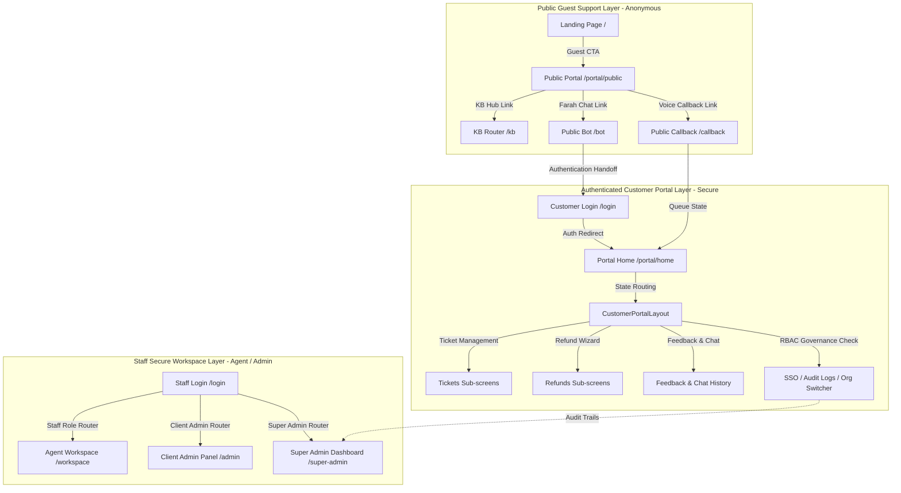
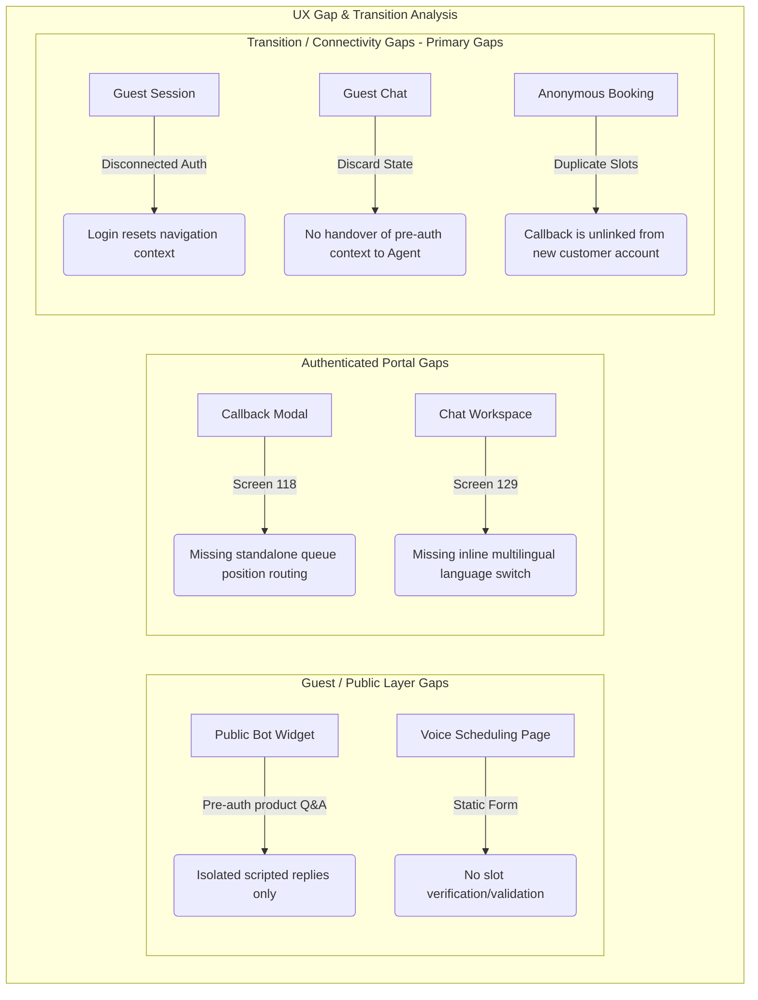

# Implementation Plan — Guest Helpdesk & Customer Self-Service Portal Expansion
## CustomerSelfService Platform — Implementation Governance

**Status:** 🟡 DRAFT (Implementation Blueprint Only)  
**Target Window:** Sprints 10 & 11  
**Last Updated:** 2026-06-09T12:15:00+05:30  
**Owner:** Lead Systems Architect (Antigravity)  
**Version:** v1.0.0

---

## 1. Current Implementation Assessment

An audit of the existing customer support interfaces and page components reveals a structurally sound, bilingual (EN/AR), and RTL-ready layout. However, there are significant gaps between the interactive placeholders and the functional coverage specified by the AI-Native mPaaS screen inventory.

### A. What Already Exists
* **Enterprise SaaS Hero Section:** Located on the main [LandingPage.tsx](file:///Users/sudhir88/Desktop/CustomerSelfService/frontend/src/components/landing/LandingPage.tsx), providing unified access points for anonymous and authenticated workspace personas.
* **Staff Secure Workspace CTA:** Points directly to `/login`, guiding support agents, supervisors, client admins, and super admins into authenticated workspaces.
* **Guest Self-Service CTA:** Points directly to `/portal/public`, directing unregistered visitors to the anonymous helpdesk gateway.
* **Global Theme Toggle & Language Selector:** Implemented in the main application context ([AppContext.tsx](file:///Users/sudhir88/Desktop/CustomerSelfService/frontend/src/context/AppContext.tsx)) and imported into the headers of [LandingPage.tsx](file:///Users/sudhir88/Desktop/CustomerSelfService/frontend/src/components/landing/LandingPage.tsx), [page.tsx](file:///Users/sudhir88/Desktop/CustomerSelfService/frontend/src/app/portal/public/page.tsx), [page.tsx](file:///Users/sudhir88/Desktop/CustomerSelfService/frontend/src/app/bot/page.tsx), and [page.tsx](file:///Users/sudhir88/Desktop/CustomerSelfService/frontend/src/app/callback/page.tsx). It dynamically shifts the document direction attribute (`dir="ltr"` / `dir="rtl"`).
* **Basic Support Cards:** Operational cards on [LandingPage.tsx](file:///Users/sudhir88/Desktop/CustomerSelfService/frontend/src/components/landing/LandingPage.tsx) detailing platform capabilities: AI bots & dialog flows, Unified agent workspace, Tenant governance, and Analytics & cost control.
* **Initial AI-Native Branding:** Uses the `Sparkles` icon and unified theme configurations to identify the "AI-Native mPaaS" control plane.

### B. What is Partially Implemented
* **Pre-auth Product Q&A:** The [PublicBotWidget.tsx](file:///Users/sudhir88/Desktop/CustomerSelfService/frontend/src/components/dashboard/PublicBotWidget.tsx) handles user input and runs regex matching for terms like `pricing`, `refund`, and `hi`, returning mock response strings. It does not interface with actual RAG indexes or a Live Chat system.
* **Pre-auth Callback Request:** Fully operational on a standalone page `/callback` via [page.tsx](file:///Users/sudhir88/Desktop/CustomerSelfService/frontend/src/app/callback/page.tsx). It captures telephone input, allows slot selection (ASAP, Morning, Afternoon, Evening), registers an audit log, and launches the queue widget. However, this is not integrated into the [PublicBotWidget.tsx](file:///Users/sudhir88/Desktop/CustomerSelfService/frontend/src/components/dashboard/PublicBotWidget.tsx) dialogue tree.
* **Multilingual Live Chat Overlay:** The [LiveChatOverlay.tsx](file:///Users/sudhir88/Desktop/CustomerSelfService/frontend/src/components/customer-portal/live-chat/LiveChatOverlay.tsx) component supports global EN/AR locales but lacks the inline per-conversation language switcher modal.
* **Voice Callback Request Form:** The [VoiceCallModal.tsx](file:///Users/sudhir88/Desktop/CustomerSelfService/frontend/src/components/customer-portal/callbacks/VoiceCallModal.tsx) component is a stub that pops up on the bottom hotline FAB click but does not manage slot selection or validation logic.

### C. What Inventory Areas are Still Missing
* **Screen 118 — Callback Queue Position (Authenticated Context):** Within the authenticated portal, submitting a voice callback does not route the user to a dedicated intermediate wait status page. It only registers the queue card inline.
* **Screens 122 & 123 — CSAT & NPS Survey (End-User Portal):** Missing customer-facing post-resolution survey panels. The existing CSAT/NPS configurations only support supervisor analytics.
* **Screen 124 — Transcript Email Modal:** Not integrated into the authenticated customer portal layout. The guest widget has [TranscriptEmailModal.tsx](file:///Users/sudhir88/Desktop/CustomerSelfService/frontend/src/components/customer-portal/feedback/TranscriptEmailModal.tsx) wired, but the customer chat overlay does not.
* **Screen 126 — Order Lookup:** Missing a dedicated customer-facing order tracking interface. Gated OTP tracking is implemented within the refund wizard but is not exposed as a general status search page.
* **Screen 129 — Multilingual Switch in Chat:** The inline globe popover switcher inside the chat overlay is missing.

### D. Architectural Positioning & Transition Gaps
* **Maturity Alignment:** The authenticated customer portal layer contains a highly mature, advanced suite of enterprise features (ticketing, OTP-gated refunds, chat history, live-support workspaces, and accessibility widgets). The guest/public layer, conversely, remains extremely minimal, offering basic information and standalone page stubs.
* **Lack of Connectivity:** The primary architectural gap is **transition continuity** between the two layers. Guest actions (chatbot queries, callback scheduling, KB article views) are entirely disconnected from the authenticated experience, causing users to lose all support context upon sign-in.

---

## 2. Architecture Clarification

To maintain security boundaries and ensure proper segregation of privileges, the Guest Helpdesk and Customer Portal experience must be organized into three logical layers:

### A. Public Guest Support Layer (Anonymous)
* **Authentication Gating:** None. Open to public web crawlers and guest visitors.
* **Entry Routes:** `/` (Landing), `/portal/public` (Guest Home), `/bot` (Guest Bot widget), `/callback` (Guest Callback).
* **State Management:** Scoped to temporary React state or ephemeral sessionStorage (cleared on tab close).
* **External Integration:** Anonymous RAG retrieval queries, IVR schedule requests, and anonymous OTP order status lookups.

### B. Authenticated Customer Portal Layer (Secure)
* **Authentication Gating:** Active security tokens required. Enforced by `ProtectedRoute` wrapper checking for the `customer` role.
* **Entry Routes:** `/portal/home` (loads the dashboard shell and components).
* **State Management:** Governed by context providers ([AppContext.tsx](file:///Users/sudhir88/Desktop/CustomerSelfService/frontend/src/context/AppContext.tsx)) and synced to local storage database mockups.
* **External Integration:** Support Ticket CRUD (Create, Read, Update, Comment), personal interaction histories, secure return authorizations, and customer profile preferences.
* **Administrative Sub-Screens:** Guarded by `canAccessGovernance` checks (requires `super_admin` or `client_admin` role). Grants read-only access to SSO latency logs, vector database quota dashboards, and system-wide audit logs.

### C. Staff Workspace Layer (Agent / Admin)
* **Authentication Gating:** Active secure session with role-based routing (checking for `agent`, `supervisor`, `client_admin`, or `super_admin` roles).
* **Entry Routes:** `/workspace`, `/admin`, `/super-admin`.
* **State Management:** Scaled global store utilizing Zustand for real-time ticket queues and active web socket feeds.
* **External Integration:** SIP voice connections, agent response macros, QA scorecard creation, shift scheduler grids, and LLM telemetry.

---

## 3. Inventory Mapping

The following table maps the screen requirements from the AI-Native mPaaS Screen Inventory against current repository files:

| Screen Name | PDF Screen ID | Operational Area | Existing Source File(s) | Status |
|---|---|---|---|---|
| **Public Site Bot Greeting** | Screen 158 | Public Bot Widget | [PublicBotWidget.tsx](file:///Users/sudhir88/Desktop/CustomerSelfService/frontend/src/components/dashboard/PublicBotWidget.tsx) | ✅ Complete |
| **Pre-auth Product Q&A (RAG)** | Screen 159 | Public Bot Widget | [PublicBotWidget.tsx](file:///Users/sudhir88/Desktop/CustomerSelfService/frontend/src/components/dashboard/PublicBotWidget.tsx) | 🟡 Partial (Scripted) |
| **Pre-auth Order Lookup** | Screen 160 | Public Bot Widget | [PublicBotWidget.tsx](file:///Users/sudhir88/Desktop/CustomerSelfService/frontend/src/components/dashboard/PublicBotWidget.tsx) | ✅ Complete (Mocked) |
| **Pre-auth Callback Request** | Screen 161 | Public Bot Widget | [page.tsx](file:///Users/sudhir88/Desktop/CustomerSelfService/frontend/src/app/callback/page.tsx) | 🟡 Partial (Separate route) |
| **Self-Service Home** | Screen 111 | Customer Portal | [CustomerDashboardHome.tsx](file:///Users/sudhir88/Desktop/CustomerSelfService/frontend/src/components/customer-portal/home/CustomerDashboardHome.tsx) | ✅ Complete |
| **KB Article View** | Screen 112 | Customer Portal | [KbArticleView.tsx](file:///Users/sudhir88/Desktop/CustomerSelfService/frontend/src/components/customer-portal/knowledge-base/KbArticleView.tsx) | ✅ Complete |
| **KB Search Results** | Screen 113 | Customer Portal | [KbSearch.tsx](file:///Users/sudhir88/Desktop/CustomerSelfService/frontend/src/components/customer-portal/knowledge-base/KbSearch.tsx) | ✅ Complete |
| **Submit Ticket (Modal)** | Screen 114 | Customer Portal | [SubmitTicketModal.tsx](file:///Users/sudhir88/Desktop/CustomerSelfService/frontend/src/components/customer-portal/tickets/SubmitTicketModal.tsx) | ✅ Complete |
| **Ticket List** | Screen 115 | Customer Portal | [TicketList.tsx](file:///Users/sudhir88/Desktop/CustomerSelfService/frontend/src/components/customer-portal/tickets/TicketList.tsx) | ✅ Complete |
| **Ticket Detail / Reply** | Screen 116 | Customer Portal | [TicketDetail.tsx](file:///Users/sudhir88/Desktop/CustomerSelfService/frontend/src/components/customer-portal/tickets/TicketDetail.tsx) | ✅ Complete |
| **Schedule Callback (Modal)** | Screen 117 | Customer Portal | [CallbackRequestModal.tsx](file:///Users/sudhir88/Desktop/CustomerSelfService/frontend/src/components/customer-portal/callbacks/CallbackRequestModal.tsx) | ✅ Complete |
| **Callback Queue Position** | Screen 118 | Customer Portal | [CallbackQueueCard.tsx](file:///Users/sudhir88/Desktop/CustomerSelfService/frontend/src/components/customer-portal/feedback/CallbackQueueCard.tsx) | ❌ Missing (No routing) |
| **Live Chat Overlay** | Screen 119 | Customer Portal | [LiveChatOverlay.tsx](file:///Users/sudhir88/Desktop/CustomerSelfService/frontend/src/components/customer-portal/live-chat/LiveChatOverlay.tsx) | ✅ Complete |
| **Voice Call Request** | Screen 120 | Customer Portal | [VoiceCallModal.tsx](file:///Users/sudhir88/Desktop/CustomerSelfService/frontend/src/components/customer-portal/callbacks/VoiceCallModal.tsx) | 🟡 Stub |
| **Co-browse Join (Modal)** | Screen 121 | Customer Portal | [CobrowseModal.tsx](file:///Users/sudhir88/Desktop/CustomerSelfService/frontend/src/components/customer-portal/callbacks/CobrowseModal.tsx) | ✅ Complete |
| **CSAT Survey (Post-Res)** | Screen 122 | Customer Portal | [CsatSurveyWidget.tsx](file:///Users/sudhir88/Desktop/CustomerSelfService/frontend/src/components/customer-portal/feedback/CsatSurveyWidget.tsx) | ❌ Missing (No portal trigger) |
| **NPS Survey (Periodic)** | Screen 123 | Customer Portal | [NpsSurveyWidget.tsx](file:///Users/sudhir88/Desktop/CustomerSelfService/frontend/src/components/customer-portal/feedback/NpsSurveyWidget.tsx) | ❌ Missing (No portal trigger) |
| **Transcript Email (Modal)** | Screen 124 | Customer Portal | [TranscriptEmailModal.tsx](file:///Users/sudhir88/Desktop/CustomerSelfService/frontend/src/components/customer-portal/feedback/TranscriptEmailModal.tsx) | ❌ Missing (Guest only) |
| **Chat History** | Screen 125 | Customer Portal | [CustomerChatHistory.tsx](file:///Users/sudhir88/Desktop/CustomerSelfService/frontend/src/components/customer-portal/shared/CustomerChatHistory.tsx) | ✅ Complete |
| **Order Lookup** | Screen 126 | Customer Portal | None | ❌ Missing |
| **Return / Refund Initiate** | Screen 127 | Customer Portal | [RefundWizard.tsx](file:///Users/sudhir88/Desktop/CustomerSelfService/frontend/src/components/customer-portal/refunds/RefundWizard.tsx) | ✅ Complete |
| **OTP Authenticate** | Screen 128 | Customer Portal | [OtpAuth.tsx](file:///Users/sudhir88/Desktop/CustomerSelfService/frontend/src/components/customer-portal/refunds/OtpAuth.tsx) | ✅ Complete |
| **Multilingual Chat Switch** | Screen 129 | Customer Portal | None | ❌ Missing |
| **Accessibility Chat Widget** | Screen 130 | Customer Portal | [AccessibilityWidget.tsx](file:///Users/sudhir88/Desktop/CustomerSelfService/frontend/src/components/customer-portal/accessibility/AccessibilityWidget.tsx) | ✅ Complete |

---

## 4. Proposed Phased Execution Roadmap

### Phase 1 — Guest Layer Completion & Guest-to-Customer Transition Continuity

#### Expected Outcome
Complete the missing guest features and construct robust data preservation channels. When guests schedule callback queues or browse KB items, their activity state, chatbot transcripts, and redirect targets are preserved and carried forward seamlessly when they register or log in.

#### Important Constraints
* Focus on transit integration paths rather than rebuilding or duplicating systems already maturely implemented within the authenticated portal flows (e.g. ticket detail view or refund wizard).
* Session data during guest phases must remain client-side (sessionStorage/localStorage) and only push to the server upon successful auth handshake.

#### Manual Outcome
1. Navigate to `/portal/public` and open the Farah AI Support Chat drawer.
2. Ask a product question, then click "File a Ticket" inside the chat.
3. Verify you are redirected to `/login?redirect=/portal/home?action=submit_ticket`.
4. Log in as a customer, and verify you are immediately redirected to the **Create Ticket** screen with the chat history from your guest session appended as reference text.
5. Schedule a voice callback anonymously on `/callback`. Verify that upon logging in, your existing callback queue status is recognized and displayed on the authenticated homepage.

#### Dependencies
* Verification of redirect query parameter support on auth pages.
* Redux or Context store extensions to hold temporary guest chat history and callback session objects before auth handshake.

#### Out-of-Scope Items
* Building custom databases for unauthenticated users.
* Transferring guest histories across separate browsers or devices (requires permanent accounts).

---

### Phase 2 — Authenticated Customer Portal

#### Expected Outcome
Wire secure account registration, customer login, session authorization validation, and personal support dashboard screens. Allows verified customers to track active cases, browse personalized recommendations, and initiate returns.

#### Important Constraints
* Gated routes must strictly return a 403 Forbidden page ([HttpStatusPage.tsx](file:///Users/sudhir88/Desktop/CustomerSelfService/frontend/src/components/customer-portal/shared/EnterpriseStates.tsx)) if an unauthenticated user or staff role attempts to load `/portal/home`.
* Registration records must map to the `customer` role in the global authentication context.

#### Manual Outcome
1. Navigate to `/register` and create an account. Verify redirection to the login screen.
2. Log in using customer credentials. Verify redirection to `/portal/home`.
3. On the dashboard, verify the personalized welcome message and the recent support actions list.
4. Select **Submit Support Ticket**. Provide title, category, priority, and description. Submit and confirm the ticket appears on the case timeline.
5. Select **Request Refund**. Initiate the Multi-Step Refund wizard, select items, and submit the request.

#### Dependencies
* `AuthContext.tsx` integration.
* Secure page rendering via `ProtectedRoute.tsx`.

#### Out-of-Scope Items
* Real-time co-browse screen sharing.
* Telephony IVR integrations.

---

### Phase 3 — Omnichannel Escalation + Live Support

#### Expected Outcome
Implement self-service to agent workspace escalation pathways. Customers can transition from AI bot chats to active agent live-chat queues or join collaborative co-browse sessions with support staff.

#### Important Constraints
* Queuing states must display clear wait telemetry (estimated queue position and standby messages).
* Co-browsing PINs must validate dynamically via mock token exchange handlers before establishing connections.

#### Manual Outcome
1. Open the **Live Chat Overlay** drawer on `/portal/home`.
2. Type "Connect to human agent". Verify the chat status updates to `queue` and indicates active position 3.
3. Wait for the queue simulation to finish. Confirm Nadia Vance (Agent persona) joins the conversation stream and sends a welcome message.
4. Open the **Co-Browse** panel in the header. Select **Generate PIN**. Provide the code `5678` in the modal input and click **Connect**.
5. Verify connection handshake indicators, followed by a completion toast on session termination.

#### Dependencies
* `LiveChatOverlay.tsx` state synchronization with `AgentWorkspaceView.tsx`.
* Synchronized state triggers for [CobrowseModal.tsx](file:///Users/sudhir88/Desktop/CustomerSelfService/frontend/src/components/customer-portal/callbacks/CobrowseModal.tsx).

#### Out-of-Scope Items
* WebRTC or audio/video recording infrastructure.
* Real telephony gateway trunk connections.

---

### Phase 4 — Enterprise UX & Accessibility (A11y)

#### Expected Outcome
Add deep accessibility configurations, translation controls, and visual contrast settings. Ensures that all interfaces comply with WCAG AA guidelines and maintain proper alignment in both English (LTR) and Arabic (RTL) views.

#### Important Constraints
* All layout alignments, padding rules, margins, and icons must switch directions automatically using CSS variables when shifting language contexts.
* High contrast configurations must toggle global CSS helper styles without affecting system rendering speeds.

#### Manual Outcome
1. On `/portal/home`, click the translation button to select **ع** (Arabic).
2. Verify that all dashboard cards, headers, form inputs, and buttons mirror to right-to-left layout.
3. Open the **Accessibility Options** modal. Change font size to **Large** and toggle **High Contrast Mode** on.
4. Verify that body text scales up, layout elements adjust without breaking bounds, and high-contrast boundaries render correctly.

#### Dependencies
* Integration of [AccessibilityWidget.tsx](file:///Users/sudhir88/Desktop/CustomerSelfService/frontend/src/components/customer-portal/accessibility/AccessibilityWidget.tsx) controls with global CSS variables.
* Translation mapping coverage inside translation files ([ar.ts](file:///Users/sudhir88/Desktop/CustomerSelfService/frontend/src/i18n/ar.ts) and [en.ts](file:///Users/sudhir88/Desktop/CustomerSelfService/frontend/src/i18n/en.ts)).

#### Out-of-Scope Items
* Browser speech synthesis integrations (screen readers will use native accessibility trees).

---

### Phase 5 — Analytics, Surveys & Enterprise Polish

#### Expected Outcome
Deploy customer satisfaction tracking components, secure administration panels, audit logs, and session timeout handlers.

#### Important Constraints
* Governance views (`customer_org_switcher`, `customer_audit_logs`, `customer_exports`, `customer_sso_status`, `customer_quotas`) must remain hidden from general customer accounts. They should only load if the user holds an administrative role (`super_admin` or `client_admin`).
* CSAT/NPS survey widgets must trigger automatically upon conversation resolution.

#### Manual Outcome
1. Complete a live chat session. Verify the CSAT survey panel loads immediately, prompting rating selections and comments.
2. Verify the NPS survey loads next, capturing recommendation scores (0-10) and registering logs.
3. Log in as an administrator. Select the **Governance** dropdown in the header and verify that audit log screens, SSO status panels, and data export tabs are visible.
4. Leave the session inactive. After 13 minutes, verify the **Session Timeout Warning** modal opens. Click **Extend** and confirm the session resets.

#### Dependencies
* Integration of [SessionTimeoutModal.tsx](file:///Users/sudhir88/Desktop/CustomerSelfService/frontend/src/components/customer-portal/enterprise/SessionTimeoutModal.tsx) state with global user session triggers.
* Survey submission hooks mapping to `CsatSurveyWidget.tsx` and `NpsSurveyWidget.tsx`.

#### Out-of-Scope Items
* Exporting log datasets to external database endpoints.
* PDF document generation for exports.

---

## 5. Guest → Authenticated Transition Continuity

To reconcile the disparity between the basic guest layer and the advanced authenticated customer layer, the platform must implement a formal session preservation architecture. Rather than treating visitor sessions as discardable, the system will use client-side state transfers to ensure user journey continuity.

### A. Chatbot State & History Handover
* **Storage Protocol:** Guest chat histories from the [PublicBotWidget.tsx](file:///Users/sudhir88/Desktop/CustomerSelfService/frontend/src/components/dashboard/PublicBotWidget.tsx) dialogue tree are serialized into a JSON array and saved to `sessionStorage` under `mPaaS_guest_chat_history`.
* **Handover Trigger:** Upon successful login routing, the authenticated chat provider ([LiveChatOverlay.tsx](file:///Users/sudhir88/Desktop/CustomerSelfService/frontend/src/components/customer-portal/live-chat/LiveChatOverlay.tsx)) checks for this key. If found, it appends the guest history to the active chat session context, allowing agents to see the pre-auth conversation.

### B. Callback Request State Synchronization
* **Active Queue Recognition:** When a guest schedules a callback on `/callback`, a unique transaction token (`callback_queue_id`) is saved in localized browser storage.
* **Dashboard Alignment:** When the user authenticates, the client-side router maps this active ID to the customer's home screen. The dashboard renders [CallbackQueueCard.tsx](file:///Users/sudhir88/Desktop/CustomerSelfService/frontend/src/components/customer-portal/feedback/CallbackQueueCard.tsx) inline, showing their current queue slot instead of requiring a re-booking.

### C. KB Navigation Context & Preserved Redirects
* **URL Parameter Forwarding:** When a guest clicks a gated CTA (such as "Escalate to Case" or "Save to Favorites") inside the knowledge hub (`/kb`), the application routes them to `/login` with an appended redirect query: `?redirect=/portal/home?view=kb_article&id=[article_id]`.
* **Login Handshaking:** The authentication wrapper parses the query parameter post-login and forwards the client to the requested nested view rather than the default home layout.

### D. Guest Escalation to Ticket Prefill
* **Context Capture:** If a visitor elects to "Open Ticket" inside `/bot`, the system caches the last 5 chat messages.
* **Pre-population:** On reaching the authenticated [SubmitTicketPage.tsx](file:///Users/sudhir88/Desktop/CustomerSelfService/frontend/src/components/customer-portal/tickets/SubmitTicketPage.tsx), the details field is pre-populated with the conversation summary: `[Visitor Chat Context]: ...`.

---

## 6. UX Gap Analysis

During auditing, several critical user experience gaps were identified, separating isolated operational modules from a connected enterprise flow:

### A. Guest / Public Gaps
* **RAG Search Context:** The public chatbot does not search actual catalog repositories, replying only with basic static matches (Screen 159).
* **Hotline Modal:** The guest-facing voice modal lacks slot validations and time range checks.

### B. Authenticated Portal Gaps
* **Screen 118 — Queue Routing:** In the customer dashboard, completing a callback scheduling task does not trigger a redirect to a standalone queue card route.
* **Screens 122 & 123 — CSAT/NPS Surveys:** Customer-facing post-conversation surveys are missing inside the customer portal view.
* **Screen 129 — Local Switcher:** No inline chat translation switcher popover exists inside the live chat overlay header.

### C. Transition & Connectivity Gaps (Primary Gaps)
* **Disconnected Visitor Handoffs:** Logging in from guest help pages clears the navigation history, routing users to `/portal/home` instead of returning them to their active search page.
* **Ephemeral Chat Discard:** Guest chatbot transcripts are not transferred to the customer portal workspace upon login, preventing support agents from viewing the user's pre-auth chat history.
* **Duplicate Callback Slots:** Guests who schedule callbacks and subsequently register an account are treated as separate records, creating duplicate queue slots.

---

## 7. Recommended Route Architecture

The customer portal will utilize the following Next.js route structures and sub-screen layouts:

### A. Public Pages (Next.js File Routes)
* `frontend/src/app/page.tsx` -> Primary landing page [LandingPage.tsx](file:///Users/sudhir88/Desktop/CustomerSelfService/frontend/src/components/landing/LandingPage.tsx).
* `frontend/src/app/portal/public/page.tsx` -> Guest Self-Service home layout.
* `frontend/src/app/bot/page.tsx` -> Anonymous chatbot page.
* `frontend/src/app/callback/page.tsx` -> Anonymous voice scheduling page.
* `frontend/src/app/kb/page.tsx` -> Public knowledge base search and article view.
* `frontend/src/app/login/page.tsx` -> User login panel.
* `frontend/src/app/register/page.tsx` -> Registration screen.

### B. Authenticated Customer Workspace Route
* `frontend/src/app/portal/home/page.tsx` -> Main gated shell.

#### Internal Sub-Screen Views (Mapped to `activeSubScreen` state)
* `customer_home` -> [CustomerDashboardHome.tsx](file:///Users/sudhir88/Desktop/CustomerSelfService/frontend/src/components/customer-portal/home/CustomerDashboardHome.tsx) (Default home).
* `customer_kb` -> [AIWorkspace.tsx](file:///Users/sudhir88/Desktop/CustomerSelfService/frontend/src/components/customer-portal/ai-copilot/AIWorkspace.tsx) (AI Search workspace).
* `customer_kb_article` -> [KbArticleView.tsx](file:///Users/sudhir88/Desktop/CustomerSelfService/frontend/src/components/customer-portal/knowledge-base/KbArticleView.tsx) (Detailed article view).
* `customer_ticket_detail` -> [TicketDetail.tsx](file:///Users/sudhir88/Desktop/CustomerSelfService/frontend/src/components/customer-portal/tickets/TicketDetail.tsx) (Ticket details).
* `customer_ticket_submit` -> [SubmitTicketPage.tsx](file:///Users/sudhir88/Desktop/CustomerSelfService/frontend/src/components/customer-portal/tickets/SubmitTicketPage.tsx) (Submit support ticket).
* `customer_order_refund` -> [RefundWizard.tsx](file:///Users/sudhir88/Desktop/CustomerSelfService/frontend/src/components/customer-portal/refunds/RefundWizard.tsx) (Initiate returns).
* `customer_my_tickets` -> [TicketList.tsx](file:///Users/sudhir88/Desktop/CustomerSelfService/frontend/src/components/customer-portal/tickets/TicketList.tsx) (Customer case history).
* `customer_chat_history` -> [CustomerChatHistory.tsx](file:///Users/sudhir88/Desktop/CustomerSelfService/frontend/src/components/customer-portal/shared/CustomerChatHistory.tsx) (Chat transcript log).
* `customer_feedback_hub` -> [FeedbackHubPage.tsx](file:///Users/sudhir88/Desktop/CustomerSelfService/frontend/src/components/customer-portal/feedback/FeedbackHubPage.tsx) (Feedback entry hub).
* `customer_notifications` -> [CustomerNotifications.tsx](file:///Users/sudhir88/Desktop/CustomerSelfService/frontend/src/components/customer-portal/notifications/CustomerNotifications.tsx) (Alert inbox).
* `customer_live_support` -> [LiveSupportWorkspace.tsx](file:///Users/sudhir88/Desktop/CustomerSelfService/frontend/src/components/customer-portal/support/LiveSupportWorkspace.tsx) (Agent chat workspace).
* `customer_recent_activity` -> [PersonalizationHub.tsx](file:///Users/sudhir88/Desktop/CustomerSelfService/frontend/src/components/customer-portal/shared/PersonalizationHub.tsx) (Audit feed).
* `customer_favorites` -> [PersonalizationHub.tsx](file:///Users/sudhir88/Desktop/CustomerSelfService/frontend/src/components/customer-portal/shared/PersonalizationHub.tsx) (Bookmarks).
* `customer_system_status` -> [SystemStatusPage.tsx](file:///Users/sudhir88/Desktop/CustomerSelfService/frontend/src/components/customer-portal/status/SystemStatusPage.tsx) (Outage dashboard).
* `customer_settings` -> [CustomerSettings.tsx](file:///Users/sudhir88/Desktop/CustomerSelfService/frontend/src/components/customer-portal/settings/CustomerSettings.tsx) (Profile config).

#### Admin-Only Governance Sub-Screen Views (Can only switch if user role is admin)
* `customer_org_switcher` -> Switches active organization/tenant context.
* `customer_audit_logs` -> Renders system compliance log search.
* `customer_exports` -> Triggers export actions.
* `customer_sso_status` -> Displays SAML integration parameters.
* `customer_quotas` -> Tracks LLM and telephony request thresholds.

---

## 8. Risks and Assumptions

### A. Risks
* **RBAC Privileges Escalation:** If governance components (`AuditLogViewer`, `OrgSwitcher`) are mounted client-side within the customer portal shell, there is a risk that users could alter states to bypass permissions.
  * *Mitigation:* Explicitly verify role constraints (`canAccessGovernance`) inside [CustomerPortalLayout.tsx](file:///Users/sudhir88/Desktop/CustomerSelfService/frontend/src/components/customer-portal/shared/CustomerPortalLayout.tsx) before mounting child components, returning `HttpStatusPage status="403"` for unauthorized access.
* **Arabic Layout (RTL) Display Issues:** Multi-step wizards like [RefundWizard.tsx](file:///Users/sudhir88/Desktop/CustomerSelfService/frontend/src/components/customer-portal/refunds/RefundWizard.tsx) might shift input alignments, causing broken form interfaces.
  * *Mitigation:* Run thorough visual regression checks on layout mirroring before moving to release stages.

### B. Assumptions
* All external data exchanges (including tickets, RAG searches, and callback schedules) will run against mock service schemas without introducing real backend database dependencies.
* The system is assumed to rely on client-side authentication states for demonstration and sandbox verification.
