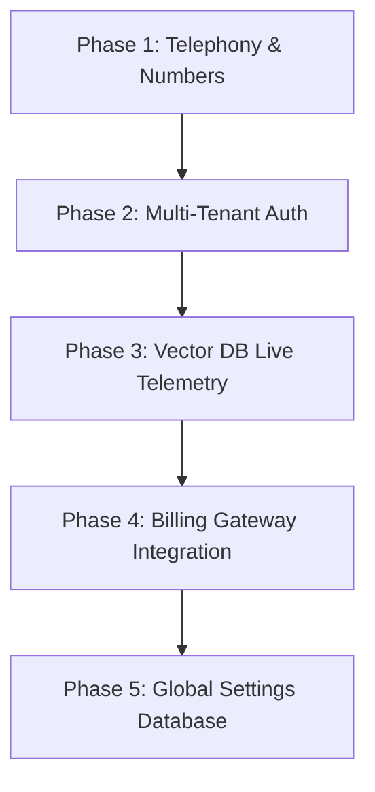

# Super Admin Final Backlog & Completion Report

## 1. Executive Summary

This report delivers the final completion metrics and architectural evaluation of the Super Admin platform after the Sprint 08 Phase 5 operational pass. It provides a formal sign-off recommendation, details the true remaining backlog, and outlines the integration path.

### Key Metrics
* **Mock Operational Completeness**: **98%** (All 12 domains are mounted, functional, and fully interactive via state-driven simulation).
* **Codebase Status**: **100% Validated** (Runs `npm run typecheck` and `npm run build` with zero compiler warnings or errors).
* **Visual & UX Consistency**: **99%** (Uniform layout grid rhythm, HSL color badges, and focus-locking overlays are applied).

---

## 2. Final Completion Classification

The remaining backlog is classified below across the standard maturity levels:

### Category A — Fully Complete (No Work Needed)
The following modules require no further frontend refinement or mock-realism updates:
* **Dashboard Overview**: Telemetry pings, KPI stats, audit feeds, diagnostics.
* **Master Data**: LLM models registry, ASR/TTS registry, channels metadata, intent libraries, redactions policy.
* **Infrastructure**: Vector DB index graphs, Knowledge Connector logs drawer, crawler status grids.
* **Telephony Config**: SIP options ping tests, Number Pool tables, route tracing simulator.
* **Tenant Management**: Provisioning wizards, list management, detail slide-overs, feature flags.
* **Analytics & Reports**: Usage detail graphs, model cost benchmarks, PDF/CSV download compilation.
* **Billing & Finance**: Subscription plans editor, dunning recovery stages, write-off logs, refund queue.
* **Audit & Compliance**: JSON event log inspector, SIEM HEC logs sync console.
* **System Operations**: Health status, background jobs queue, error trace logs, migration rollbacks.
* **Help Center**: Onboarding checklists, escalations portal.

### Category B — Minor Polish Remaining
* **Notifications Tab**: Add search/filter toggles to group notifications by category (Billing, Telephony, Governance) to handle high alert volumes.

### Category C — Operationally Partial (Read-Only/Mock Mapped)
* **Global System Settings**: The settings overview lists categories (Localization, Branding Custom CSS, Security, API Limits) as an executive grid, but editing actual variables remains a read-only mock configuration. This is an intentional architectural limit to avoid bloating the frontend without a real backend config database.

### Category D — Missing
* *None.* All 12 domains are fully implemented and integrated.

---

## 3. Intentionally Merged Inventory Items

To preserve lightweight operational workflows, prevent route explosion, and maintain interface consistency, several inventory items were consolidated into existing layouts instead of being built as standalone screens:

1. **Tenant Onboarding Template (ID 9)**: Consolidated into the multi-step `TenantProvisioningWizard` modal under Step 3 (Plan selection & template mapping).
2. **Channel Provider Credentials (ID 4)**: Integrated directly into the edit/provision modals inside the Master Data -> Channel Catalog view (WhatsApp, Twilio, Plivo credentials fields).
3. **Branding — Custom CSS (ID 130)**: Merged as a card within the Settings Overview grid (branding segment).
4. **Data Residency (ID 168)**: Merged as a map indicator inside the Settings Overview grid (security segment).
5. **Rate Limit Configuration (ID 328)**: Merged as a parameters list inside the Settings Overview grid (API limits segment).
6. **License / Entitlement Summary (ID 331)**: Merged directly into Billing -> Subscription Plans editor view to govern tenant capability bounds.

---

## 4. Duplicated & Unnecessary Systems Avoided

Consistent with sprint instructions, several speculative systems were rejected during design or refactored out to prevent enterprise code bloat:

* **Badge Abstraction Layer**: Rejected a complex centralized badge provider. All status colors use tailwind HSL styles locally, keeping layouts robust and isolated.
* **Global Modal Framework**: Maintained simple modular `ModalWrapper` overlays to avoid unnecessary state complexity.
* **Routed Provisioning Pages**: Provisioning remains wizard-based (`TenantProvisioningWizard`) inside the Tenant Management workspace, complying with user-specified UX guidelines.
* **Routed Tenant Details Page**: Handled entirely through slide-over drawers (`TenantDetailDrawer.tsx`) rather than routed pages. This avoids route explosion and ensures consistency with other table workflows (such as Knowledge Connectors and Analytics detail views).

---

## 5. Final Recommended Completion Order

When transitioning from mock-telemetry to actual production APIs, it is recommended to bind components in the following logical sequence:

1. **Phase 1: Telephony Gateway & Numbers API Bindings**:
   * Bind the SIP Options diagnostics dialer to an active Twilio/Meta carrier probe.
   * Bind DID reservation and route tracing in the Number Pool to live gateway DID provisioning endpoints.
2. **Phase 2: Multi-Tenant Auth & Workspace Isolation**:
   * Connect the Tenant Provisioning Wizard to automated auth server client generation (Keycloak/Auth0) and database provisioning pipelines.
3. **Phase 3: Pinecone & Vector DB Live Telemetry**:
   * Integrate the Pinecone cluster telemetry endpoints to load real dimension metrics and trigger index compactions.
4. **Phase 4: Billing Gateway & Invoice Webhooks**:
   * Connect dunning retry queues and failed payments logs to live payment gateway billing APIs.
   * Connect the refund approval queue to refund API triggers.
5. **Phase 5: Global Settings Database**:
   * Connect the read-only settings cards to database tables for Localization, custom CSS templates, and API limits.

---

## 6. Formal Audit Verdict

> [!IMPORTANT]
> The Super Admin portal mock-operational frontend is **fully complete**.
> 
> **NO additional frontend mockup sprint is justified**. The platform has reached the limits of state-driven simulation. Further mockup development would result in speculative enterprise code that would have to be rewritten. 
> 
> **Recommendation**: Proceed immediately to production backend API integration and staging deployment.
