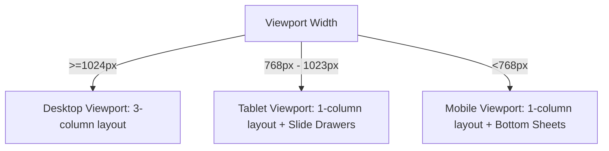

# Sprint 01 — Responsive & RTL Baseline Plan

This plan outlines the layout scaling patterns, responsive breakpoints, and internationalization mirroring rules for the Support Agent Workspace.

---

## 1. Responsive Viewport Scaling

The workspace uses layout scaling to adapt across desktop, tablet, and mobile viewports.

### Desktop Layout Viewport (`>=1024px`)
* Renders the full 3-column workspace split-pane (Inbox, Active Chat, Details panel).
* Sidebars remain pinned.

### Tablet Layout Viewport (`768px - 1023px`)
* The active conversation panel expands to fill the central view.
* The Inbox and Customer Details panels collapse into side drawers.
* Toggles are added to the header to open the side panels.

### Mobile Layout Viewport (`<768px`)
* Displays the active conversation and composer in a single-column layout.
* Navigation menus, Inbox queues, and details are accessed via bottom sheets (`MobileSheet`).
* Touch targets are expanded to at least `44px` to improve usability.

---

## 2. Drawer & Sheet Controls

* **Drawers**: Drawer panels slide in from the screen edges (right in LTR, left in RTL). Focus is trapped within the active drawer.
* **Sheets**: Mobile sheets slide up from the bottom of the viewport, with height limited to `85vh` to prevent content cutoff.
* **Mobile Overflow Prevention**: Outer layout panels use `overflow: hidden`, with scroll events isolated to inner lists (Timeline, Inbox) to prevent page-level scrollbars.
* **Safe Area Handling**: Padding calculations include mobile notches (`env(safe-area-inset-bottom)`) to ensure composer text inputs are not obscured by device controls.

---

## 3. Arabic RTL Mirroring Rules

Setting the language to Arabic (`ar`) updates layout directions:
* **CSS Direction Attribute**: The layout shell applies `dir="rtl"` and `lang="ar"` attributes to the `<html>` node.
* **Grid Mirroring**: Column grids and sidebar positions mirror their order.
* **Text Alignments**: Alignment defaults mirror (Arabic text aligns right).
* **Icon Mirroring**: Directional icons (arrows, chevron indicators, play buttons) mirror their orientation. Static icons (search, user icons) remain unchanged.
* **Scrollbars**: Scrollbars transition to the opposite side of scrollable list panels (left side in RTL mode).
