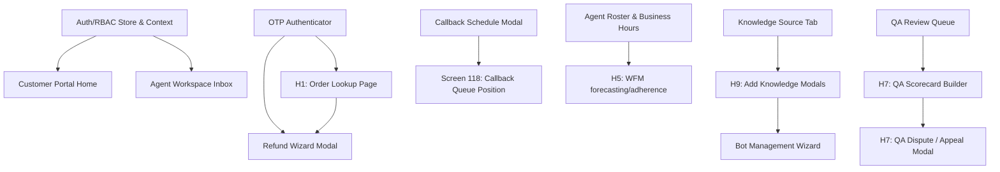
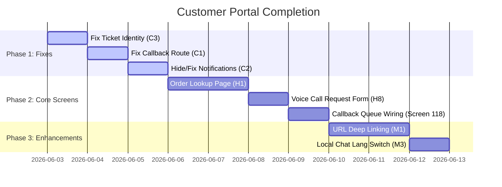
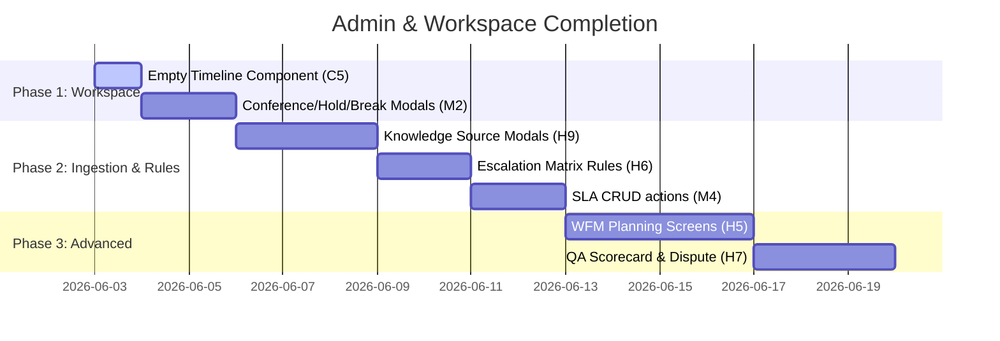
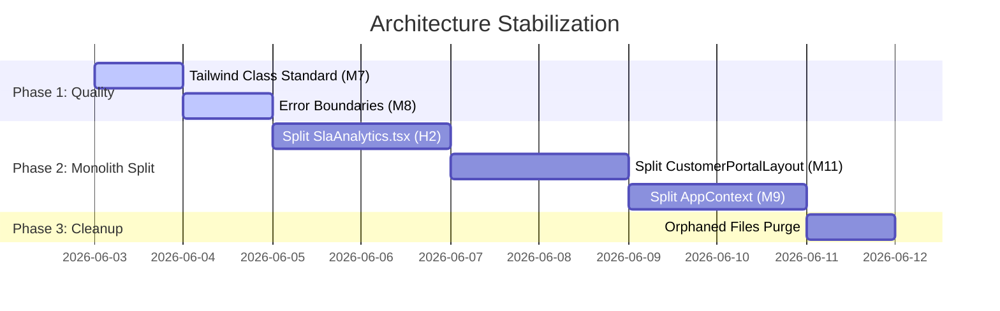

# Master Execution Roadmap
## CustomerSelfService Platform — AI-Native mPaaS

**Reference Audit:** `enterprise-audit-report-2026-06-03.md`  
**Last Updated:** 2026-06-03T16:03:20+05:30  
**Auditor / Architect:** Senior Enterprise Frontend Auditor (Antigravity)  
**Purpose:** Strategic development blueprint mapping remaining scope, architectural stabilization, and code hygiene sprints.

---

## Table of Contents

1. [Executive Summary & Strategy](#1-executive-summary--strategy)
2. [Module Dependency Analysis](#2-module-dependency-analysis)
3. [Prioritized Backlog Breakdown](#3-prioritized-backlog-breakdown)
   - [Critical Blockers (C1–C5)](#critical-blockers-c1c5)
   - [High Priority Implementation Gaps (H1–H9)](#high-priority-implementation-gaps-h1h9)
   - [Architecture Debt & Refactoring (M1–M11)](#architecture-debt--refactoring-m1m11)
   - [Cleanup & Code Hygiene](#cleanup--code-hygiene)
   - [Optional Enhancements (L1–L7)](#optional-enhancements-l1l7)
4. [High-Impact Prioritization (ROI Matrix)](#4-high-impact-prioritization-roi-matrix)
5. [Modular Execution Roadmaps](#5-modular-execution-roadmaps)
   - [A. Customer Portal Completion Roadmap](#a-customer-portal-completion-roadmap)
   - [B. Admin & Workspace Completion Roadmap](#b-admin--workspace-completion-roadmap)
   - [C. Architecture Stabilization Roadmap](#c-architecture-stabilization-roadmap)
6. [Sprint Release Plan (Phases 1–7)](#6-sprint-release-plan-phases-17)

---

## 1. Executive Summary & Strategy

The CustomerSelfService repository represents a premium, highly mature Next.js multi-role frontend application. With the **Customer Self-Service Portal** currently standing at **85% completion** and the core **Agent Workspace** at **74%**, the platform is very close to a production-ready candidate.

However, the path to release requires addressing 5 critical blockers, 9 high-priority functional gaps, and significant architectural debt. The roadmap strategy is divided into three parallel tracks:
1. **Stabilization & Fixes:** Resolve navigation bugs, data-leaks, and broken components.
2. **Feature Completion:** Address gaps in PDF coverage (Order Lookup, Knowledge Modals, WFM, QA dispute, Escalation matrix).
3. **Refactoring & Optimization:** Decompose monolithic code files to ensure maintainability, add error boundaries, and establish clean API interfaces.

---

## 2. Module Dependency Analysis

Before executing the roadmap, the development team must respect structural and logical dependencies between components and modules.



### Critical Path Dependencies
1. **Authentication Context Integration (Pre-requisite for Ticket Submission):** The `useAuth` user session must be integrated before resolving the hardcoded ticket identities to avoid broken submissions.
2. **Order Lookup to Refund Pipeline:** The new [OrderLookup.tsx](file:///Users/sudhir88/Desktop/CustomerSelfService/src/components/customer-portal/orders/OrderLookup.tsx) is a logical precursor to the return process; the [RefundWizard.tsx](file:///Users/sudhir88/Desktop/CustomerSelfService/src/components/customer-portal/refunds/RefundWizard.tsx) will be updated to accept parameters passed directly from the order lookup screen.
3. **Callback Submission to Queue View:** The callback request handler in [CallbackRequestModal.tsx](file:///Users/sudhir88/Desktop/CustomerSelfService/frontend/src/components/customer-portal/callbacks/CallbackRequestModal.tsx) must feed data directly into [CallbackQueueCard.tsx](file:///Users/sudhir88/Desktop/CustomerSelfService/frontend/src/components/customer-portal/feedback/FeedbackHub.tsx#L80) upon submission.

---

## 3. Prioritized Backlog Breakdown

### Critical Blockers (C1–C5)
> *Resolution is mandatory before staging deployment.*

| ID | Backlog Item | Location | Complexity | Est. Effort | Dependency |
|---|---|---|---|---|---|
| **C1** | **Dead `/callback` Route**<br>Create `/app/callback/page.tsx` or handle callback forms inline to avoid 404 navigation failures. | [middleware.ts](file:///Users/sudhir88/Desktop/CustomerSelfService/frontend/src/middleware.ts#L19) / [public/page.tsx](file:///Users/sudhir88/Desktop/CustomerSelfService/frontend/src/app/portal/public/page.tsx) | Low | 0.5 Day | None |
| **C2** | **Silent `customer_notifications` Link**<br>Build a basic customer notification center subscreen or temporarily hide the sidebar link. | [Sidebar.tsx](file:///Users/sudhir88/Desktop/CustomerSelfService/frontend/src/components/dashboard/Sidebar.tsx#L116) / [CustomerPortalLayout.tsx](file:///Users/sudhir88/Desktop/CustomerSelfService/frontend/src/components/customer-portal/shared/CustomerPortalLayout.tsx) | Low | 0.5 Day | None |
| **C3** | **Hardcoded Customer Identity in Tickets**<br>Replace `'David Miller'` and `david.miller@yahoo.com` with session properties from `useAuth()`. | [CustomerPortalLayout.tsx](file:///Users/sudhir88/Desktop/CustomerSelfService/frontend/src/components/customer-portal/shared/CustomerPortalLayout.tsx#L188-L189) | Low | 1 hour | `AuthContext` |
| **C4** | **Orphaned Voice Components (13 Files)**<br>Decide to wire voice UI components into the workspace or clean them out of the build path. | `src/components/voice/` | Medium | 1.5 Days | Workspace UI |
| **C5** | **Empty `ConversationTimeline.tsx` Component**<br>Implement timeline events (agent joins, channel changes) or safely exclude imports. | [ConversationTimeline.tsx](file:///Users/sudhir88/Desktop/CustomerSelfService/frontend/src/components/agent-workspace/ConversationTimeline.tsx) | Medium | 0.5 Day | `UnifiedInbox` |

---

### High Priority Implementation Gaps (H1–H9)
> *Required to achieve 100% core PDF compliance.*

| ID | Backlog Item | Location | Complexity | Est. Effort | Dependency |
|---|---|---|---|---|---|
| **H1** | **Order Lookup Standalone Page (Screen 126)**<br>Build standalone lookup interface with OTP validation and delivery timelines. | `src/components/customer-portal/orders/` | Medium | 2 Days | `OtpAuth` |
| **H2** | **Decompose `SlaAnalytics.tsx` Monolith (86KB)**<br>Break the 1,774-line component into isolated, unit-testable sub-panels. | [SlaAnalytics.tsx](file:///Users/sudhir88/Desktop/CustomerSelfService/frontend/src/components/analytics/SlaAnalytics.tsx) | High | 2 Days | None |
| **H3** | **Integrate Unwired Integration Components**<br>Wire ApiCredentialVault, RetryQueuePanel, SyncTimeline, etc. into client admin settings. | `src/components/integrations/` | Medium | 1.5 Days | Admin Layout |
| **H4** | **Operational Event Popups System (Screens 147–157)**<br>Wire 11 operational toasts and banners using the existing notification store. | `src/stores/notifications/` | High | 3 Days | `notificationsStore` |
| **H5** | **WFM Planning & Adherence (Screens 92–93)**<br>Build scheduling calendars and adherence data tables utilizing existing WFM metrics. | `src/components/client-admin/wfm/` | High | 4 Days | `workforceMetricsSeed.ts` |
| **H6** | **Escalation Matrix Rules Engine (Screen 83)**<br>Create automatic escalation rules configuration panel for tickets. | `src/components/client-admin/operations/` | Medium | 2 Days | SLA Rules Store |
| **H7** | **QA Scorecard Builder & Dispute (Screens 88, 90)**<br>Implement QA scorecard editor and agent dispute modals within QA dashboard. | `src/components/client-admin/qa/` | High | 3 Days | `QAManagerView.tsx` |
| **H8** | **Full Voice Call Request Form (Screen 120)**<br>Expand the 1.3KB `VoiceCallModal` stub into a multi-input interactive callback scheduler. | [VoiceCallModal.tsx](file:///Users/sudhir88/Desktop/CustomerSelfService/frontend/src/components/customer-portal/callbacks/VoiceCallModal.tsx) | Medium | 0.5 Day | None |
| **H9** | **Source File / URL / DB Ingestion Modals (Screens 44–47)**<br>Build modal drawers to configure PDF uploads, web crawling, and SQL database connections. | `src/components/client-admin/knowledge/` | High | 3 Days | `KnowledgeBaseTab.tsx` |

---

### Architecture Debt & Refactoring (M1–M11)
> *Improves long-term codebase scale, resilience, and debugging capabilities.*

| ID | Backlog Item | Complexity | Est. Effort | Primary Focus |
|---|---|---|---|---|
| **M1** | **Customer Portal URL Param Routing**<br>Hydrate `activeSubScreen` from URL search parameters to support external deep-linking. | Medium | 1.5 Days | Routing Engine |
| **M2** | **Conference, Hold, Break/Aux Modal Realism**<br>Upgrade simple stubs to mock participant additions and real-time timer updates. | Medium | 1.5 Days | Workspace UI |
| **M3** | **Multilingual Chat Switcher (Screen 129)**<br>Provide local EN/AR translation toggles within the chat window without forcing app-wide re-render. | Medium | 1 Day | `LiveChatOverlay` |
| **M4** | **SLA Policy CRUD Operations**<br>Expose full Create/Edit/Delete actions on SLA rules. | Medium | 1.5 Days | SLA Store |
| **M5** | **Dialog Flow: Tool Node & Context Inspector**<br>Complete visual drawer to define tool calls and inspect dialog builder variables. | High | 2.5 Days | `DialogBuilder` |
| **M6** | **Coaching Whisper & Supervisor Monitor Actions**<br>Refine supervisor dashboard tabs to display real conversation logs and whispers. | Medium | 2 Days | Supervisor View |
| **M7** | **Standardize Tailwind Color Classes**<br>Eliminate custom color classes (`slate-850`, `emerald-650`, etc.) in favor of tailwind-approved variables. | Low | 0.5 Day | Design System |
| **M8** | **Introduce React Error Boundaries**<br>Prevent localized frontend component crashes from taking down entire routes. | Low | 0.5 Day | Stability |
| **M9** | **Refactor `AppContext.tsx` Monolith**<br>Split global state context into modular contexts (e.g. `TicketsContext`, `BotsContext`). | High | 2 Days | Architecture |
| **M10**| **Update Repository README.md**<br>Replace Next.js starter instructions with project configurations, directory layouts, and setup guides. | Low | 0.5 Day | Documentation |
| **M11**| **Decompose `CustomerPortalLayout.tsx` (714 lines)**<br>Extract individual sub-screens into dedicated, context-isolated components. | High | 2 Days | Architecture |

---

### Cleanup & Code Hygiene
> *Targeted code sweeps to purge legacy developer scripts and logs.*

- **Purge 18 Root Debug Scripts:** Delete orphaned python utilities (e.g., `check_log_contents.py`, `find_line_with_key.py`, `get_subagent_input.py`) and dump files (`en_portal.txt`, `log_check.txt`). Move active utilities (`merge_ar.py`, `pdf2txt.swift`) to a new `scripts/` folder.  
- **Add Build Artifacts to Gitignore:** Gating `.DS_Store`, `tsconfig.tsbuildinfo`, and local typescript build logs.
- **Rename Project Package:** Correct package name `"temp-app"` inside `package.json` to `"customer-self-service-portal"`.

---

### Optional Enhancements (L1–L7)
> *Enhances enterprise compliance and developer onboarding; non-blocking.*

- **L1/L2:** Verify Common Per App scope matrix (RBAC controls and Billing screens are functional but check boundaries).
- **L3:** Construct remaining optional Super Admin screens (PII Redaction Matrix, global profanity configs).
- **L4/L5:** Introduce mock api layer and charting engine (recharts/visx).
- **L6/L7:** Establish Playwright end-to-end user-flow validation scripts.

---

## 4. High-Impact Prioritization (ROI Matrix)

To maximize velocity, the roadmap highlights **Quick Wins** (low effort, high user visibility) and **High ROI Fixes** (substantial architectural protection with reasonable implementation times).

```
                      HIGH IMPACT
             ┌─────────────────────────────┐
             │  * Order Lookup (H1)        │  * Decompose Monoliths (H2/M11)
             │  * Voice Call Form (H8)     │  * Knowledge Source Modals (H9)
             │  * Ticket Identity (C3)     │  * Dialog Builder Nodes (M5)
             │  * Error Boundaries (M8)    │  * WFM forecasting (H5)
             │                             │
 LOW EFFORT  ├─────────────────────────────┼─────────────────────────────┤ HIGH EFFORT
             │  * Dead Callback Route (C1) │  * 13 Voice Comp wiring (C4)
             │  * Hide Notification link   │  * API Service Layer (L4)
             │    (C2 - Quick Option)      │  * Super Admin Modules (L3)
             │  * Purge Debug Files        │  * Full E2E Test Suite (L6)
             │  * Rename package.json      │
             └─────────────────────────────┘
                      LOW IMPACT
```

### Quick Wins (Under 0.5 Day)
1. **Resolve Blocker C3 (Customer Identity in Tickets):** Replaces hardcoded strings with auth metadata. Immediately secures database write-backs.
2. **Resolve Blocker C1 (Dead Callback Route):** Avoids 404 page routing triggers.
3. **Purge Root Debug Scripts:** Instantly cleans git history index and file catalog.
4. **Implement React Error Boundaries (M8):** Safeguards layout containers from rendering failures.

### High ROI Fixes (High impact, Medium Effort)
1. **Order Lookup Standalone Page (H1):** Connects the portal landing page with the Refund pipeline; crucial for complete customer journeys.
2. **Customer Portal URL search param routing (M1):** Unlocks deep-linking to support tickets and knowledge base articles.
3. **Decompose SlaAnalytics.tsx (H2):** Reduces Next.js hot-rebuild delays from ~5s to sub-second.

---

## 5. Modular Execution Roadmaps

### A. Customer Portal Completion Roadmap



1. **Step 1 (Fix C3):** Bind the submission payload to `user.name` and `user.email` from `useAuth()`.
2. **Step 2 (Fix C1):** Implement `src/app/callback/page.tsx` rendering `CallbackRequestModal` as a full page.
3. **Step 3 (Fix C2):** Either hide `customer_notifications` from [Sidebar.tsx](file:///Users/sudhir88/Desktop/CustomerSelfService/frontend/src/components/dashboard/Sidebar.tsx#L116) or build a notifications subscreen using the `notificationsStore`.
4. **Step 4 (Build H1):** Place a tracking field on `/portal/home`. Fetch mockup order lists via dynamic OTP checking.
5. **Step 5 (Expand H8):** Upgrade [VoiceCallModal.tsx](file:///Users/sudhir88/Desktop/CustomerSelfService/frontend/src/components/customer-portal/callbacks/VoiceCallModal.tsx) to capture callback window details.
6. **Step 6 (Wire Screen 118):** Trigger redirect to `CallbackQueueCard` inside Feedback Hub upon submitting callback schedules.

---

### B. Admin & Workspace Completion Roadmap



1. **Step 1 (Fix C5):** Add visual events log to [ConversationTimeline.tsx](file:///Users/sudhir88/Desktop/CustomerSelfService/frontend/src/components/agent-workspace/ConversationTimeline.tsx) tracking notes and channel changes.
2. **Step 2 (Upgrade M2):** Feed timer details and active participants to Hold and Conference overlays.
3. **Step 3 (Build H9):** Create upload, scraper, and connection modals in client admin knowledge settings.
4. **Step 4 (Build H6):** Implement escalation matrix routing rules builder.
5. **Step 5 (Build H5):** Integrate WFM forecast visual charts and shift planners.
6. **Step 6 (Build H7):** Implement scoring templates and QA dispute appeal routes.

---

### C. Architecture Stabilization Roadmap



1. **Step 1 (Fix M7):** Perform regex search-replace across CSS elements for invalid color class formats.
2. **Step 2 (Fix M8):** Insert `<ErrorBoundary>` wrapper elements surrounding page routing portals.
3. **Step 3 (Fix H2):** Deconstruct `SlaAnalytics.tsx` into: SlaBreachMonitor, SlaQueueHealth, SlaTrendCharts, SlaIncidentTimeline, SlaLeaderboard, and SlaAIInsights.
4. **Step 4 (Fix M11):** Extract distinct subscreens from `CustomerPortalLayout.tsx`.
5. **Step 5 (Fix M9):** Migrate global AppContext records into dedicated feature scopes.

---

## 6. Sprint Release Plan (Phases 1–7)

To guarantee stability, code sweeps, refactor passes, and feature deployments are planned across seven distinct release phases:

### Phase 1: Hotfix & Stabilization (Sprint 1 — 1 Week)
* **Goal:** Resolve immediate blocking bugs and establish baseline application stability.
* **Scope:**
  - Fix C1 (Dead `/callback` route).
  - Fix C2 (Hide `customer_notifications` sidebar navigation).
  - Fix C3 (Bind ticket submit to `useAuth()` metadata).
  - Fix C5 (Create conversation event timeline layout).
  - Wire React error boundaries (`M8`) at routing borders.
  - Standardize custom colors (`M7`) to valid Tailwind palettes.

### Phase 2: Customer Portal Completeness (Sprint 2 — 1.5 Weeks)
* **Goal:** Build missing customer-facing screens.
* **Scope:**
  - Build H1 (Order Lookup standalone portal page).
  - Build H8 (Interactive Voice Call request form).
  - Wire Screen 118 (Route callback schedule confirmation to live queue card).
  - Build M1 (Support search parameter hash deep-linking).
  - Build M3 (Local EN/AR translation panel inside live chat overlay).

### Phase 3: Admin Features & SLA Configuration (Sprint 3 — 2 Weeks)
* **Goal:** Enable knowledge file/database ingestion tools and dynamic SLA rules.
* **Scope:**
  - Build H9 (File Upload, URL Crawler, and DB Connector drawers).
  - Build H6 (Automatic Escalation Matrix setup wizard).
  - Build M4 (SLA Policy definition CRUD operations).
  - Build H3 (Reconnect unwired Integration dashboards).
  - Decouple orphaned voice components (`C4`) or purge them based on engineering review.

### Phase 4: Structural Architecture Refactor (Sprint 4 — 1.5 Weeks)
* **Goal:** Break up monolithic files to resolve technical debt before releasing advanced modules.
* **Scope:**
  - Decompose H2 (SlaAnalytics.tsx monolith split).
  - Decompose M11 (CustomerPortalLayout.tsx component extraction).
  - Decompose M9 (Split AppContext.tsx into domain context wrappers).
  - Clean repository root directory (Purge debug files and scripts).
  - Rewrite README.md with onboarding documentation.

### Phase 5: Workforce & Quality Assurance Systems (Sprint 5 — 2 Weeks)
* **Goal:** Implement scheduling charts, quality scorecards, and system-event notifications.
* **Scope:**
  - Build H5 (WFM Schedule Forecast calendar & Adherence reports).
  - Build H7 (QA Scorecard Criteria Builder & Agent dispute/appeals flow).
  - Build H4 (11 system event toasts: PII detected, bot publishes, bypass logs).
  - Upgrade M2 (Timer support inside Workspace Hold/Conference views).
  - Complete remaining minor enhancements (Playwright test configurations).

### Phase 6: Super Admin Core Configuration & Telephony (Sprint 6 — 2 Weeks)
* **Goal:** Implement the core platform configuration and telephony layout components.
* **Scope:**
  - Build Screen 9 (Tenant onboarding template).
  - Build Screen 13 (Knowledge connector registry).
  - Build Screen 14 (Number pool).
  - Polish Screen 10 (Cross-tenant analytics) and Screen 11 (Model cost benchmarks).
  - Complete Screen 15 (SIP trunk config) details form.
  - Restructure sidebar layout and normalize route permissions.

### Phase 7: Super Admin Platform Common & Compliance (Sprint 7 — 2 Weeks)
* **Goal:** Implement the platform common settings and compliance audit trails.
* **Scope:**
  - Build Platform Billing Plans (Common Per App).
  - Build Immutable System Audit Trail (Common Per App).
  - Convert platform common components to nested container tab layouts.

---

*Recommended Execution Sequence: Phase 1 ──> Phase 2 ──> Phase 4 (Stability check) ──> Phase 3 ──> Phase 5 ──> Phase 6 ──> Phase 7*  
*This sequence ensures all customer portal and agent workspace features are stable before deploying final platform operator orchestration modules.*
