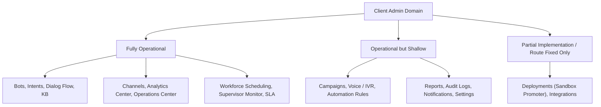

# Client Admin Domain Final Gap Report

This report outlines the technical and user experience gaps in the Client Admin workspaces, categorizing modules by operational depth, highlighting mock-only limitations, and detailing priority recommendations for final production refinement.

---

## 1. Classification of Client Admin Modules

Each workspace has been audited against mature Super Admin capabilities and classified into one of three structural categories:

### A. Fully Operational Modules (Production-Ready)
These screens have full state management, connect to AppContext, update global stores, and have complex visual interactors:
- **Operations & Workforce**: Operations Center (`agents`), Workforce Scheduling (`workforce`), Supervisor Monitor (`supervisor_monitor`), SLA Performance (`sla`), Queue Inbox (`inbox`).
- **AI & Knowledge**: Bots (`bots`), Dialog Flow (`dialog_flow`), Intents (`intents`), Knowledge Base (`knowledge_base`), Training (`training`), Guardrails (`guardrails`).
- **Governance & Analytics**: Analytics Center (`analytics_center`), Billing (`billing`), RBAC Directory (`rbac`).

### B. Operational but Shallow (Mock-State Simulators)
These screens render beautiful and responsive UIs with active actions, but do not write changes back to centralized database tables or persistent stores:
- **Campaigns (`campaigns`)**: Simulates campaigns table, cloning, and pausing, but state resides in local React `useState` hooks.
- **Voice / IVR (`voice_ivr`)**: Interactive call simulator and status toggles update locally, but does not modify Twilio or Vonage provider API config records.
- **Automation Rules (`automation_rules`)**: Quick form rule creator updates rules grid dynamically, but rules are lost upon page reload.
- **Reports (`reports`)**: Download simulation behaves realistically, but generated PDF files use generic template layouts.
- **Audit Logs (`audit_logs`)**: Search query and category filters operate on a static local logs array rather than querying a backend logs server.
- **Notifications (`notifications`)**: Warnings dispatcher simulates alerts correctly, but values do not load from a shared message broker.
- **Settings (`settings`)**: Color pickers, SLA sliders, and toggle switches adjust state variables but do not persist custom configurations to tenant profiles.

---

## 2. Identified Frontend Gaps

The primary architectural gaps in the Client Admin domain represent a lack of data persistence:

### 1. State Synchronization & Persistence
- **Gap**: All 7 newly activated modules in Phase 4 operate on transient component states. Pushing save actions, creating campaigns, adding holidays, or editing settings does not persist adjustments beyond the active session.
- **Impact**: Changes are wiped out upon browser reload.
- **Recommendation**: Create a Zustand store or expand `AppContext` to track the state of campaigns, voice providers, automation rules, settings, and audit logs.

### 2. PDF/CSV Exporter Compilation
- **Gap**: The reports export action uses a 2-second setTimeout delay to simulate compiler execution and alerts users with mock alerts, but does not generate actual files.
- **Impact**: Feature feels incomplete for enterprise testing.
- **Recommendation**: Wire the download buttons to trigger browser-side table exports using CSV packages (e.g., `xlsx` or standard data URI methods).

### 3. Settings Accent Mode
- **Gap**: The settings workspace color picker updates a local accent color string state, but this value does not update standard tailwind theme configurations or CSS variable sheets.
- **Impact**: Accent color variations do not affect global buttons, borders, or text styles.
- **Recommendation**: Inject the chosen color directly to document variables (e.g., `document.documentElement.style.setProperty('--primary-accent', color)`) so branding updates reflect immediately across all tabs.

---

## 3. Recommended Polish Priorities

| Priority Category | Targeted Feature | Described Gap | Actionable Polish Refinement |
| :---: | :--- | :--- | :--- |
| **High** | Settings Variable Injection | Accent color picker does not style global UI elements. | Bind settings accent picker to root CSS variables to skin the client shell. |
| **High** | Zustand State Integration | New workspaces use local state variables which clear on refresh. | Migrate local arrays for Campaign/IVR/Automation to a persistent state store. |
| **Medium** | CSV Data Exporters | Reports export action only generates a mock alert. | Implement client-side CSV downloads for tables inside Reports and Audit Logs. |
| **Medium** | Websocket Alerts | Live notification updates only run on manual test click dispatches. | Connect notification store events to simulate automatic alerts over time. |
| **Low** | Audit Logs Pagination | Logs ledger lists all items on a single scrollable viewport. | Add standard pagination controls for the audit logs grid to optimize loading times. |
